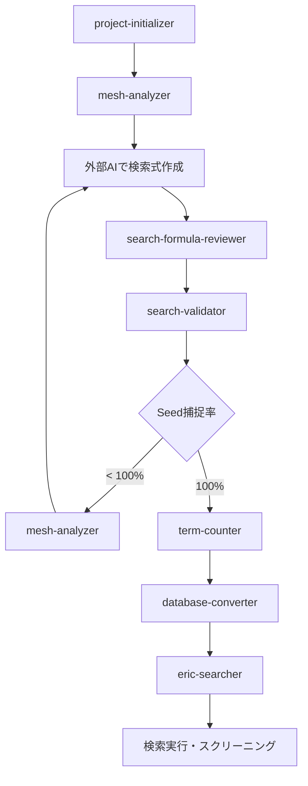

# Skills Overview

このディレクトリには、Claude Codeで使用できるskillsが格納されています。各skillは、systematic review検索式開発プロセスの特定のタスクを自動化します。

## Available Skills

| # | Skill名 | 説明 | 主な機能 |
|---|---------|------|----------|
| 1 | **search-validator** | 検索式の検証 | Seed paper捕捉確認、総件数確認 |
| 2 | **mesh-analyzer** | MeSH term分析 | MeSH抽出、階層分析、重複チェック |
| 3 | **database-converter** | データベース形式変換 | PubMed → CENTRAL/Embase/ClinicalTrials/ICTRP |
| 4 | **term-counter** | 検索語件数確認 | 各行ヒット数、ブロック重複分析 |
| 5 | **project-initializer** | プロジェクト初期化 | ディレクトリ構造作成、テンプレート配置 |
| 6 | **eric-searcher** | ERIC検索 | 教育データベース検索、シソーラス確認 |
| 7 | **search-formula-reviewer** | 検索式包括レビュー | Protocol対応確認、Pearl Growing、MeSH検証を一括実行 |

## Quick Start

### 使用方法

Skillsは、Claude Codeとの自然言語対話で自動的に発動します。

**例**:
```
User: PPSプロジェクトの検索式を検証して

Claude: search-validatorスキルを実行します...
[検証結果を表示]
```

### 発動キーワード例

各skillの詳細な発動条件は、個別のskillファイルを参照してください。

#### search-validator
- "検索式を検証して"
- "seed paperを確認"
- "validationを実行"

#### mesh-analyzer
- "MeSHを抽出して"
- "MeSH階層を調べて"
- "MeSH termの重複をチェック"

#### database-converter
- "他のデータベース形式に変換"
- "CENTRAL形式に変換して"
- "全データベース形式に変換"

#### term-counter
- "各キーワードの件数を調べて"
- "ブロックの重複を分析"
- "検索語の効果を確認"

#### project-initializer
- "新しいプロジェクトを作成"
- "プロジェクト構造を作成して"

#### eric-searcher
- "ERICで検索"
- "ERICシソーラスを確認"

#### search-formula-reviewer
- "検索式をレビューして"
- "検索式の包括的レビュー"
- "pearl growingを実行"
- "組み入れ基準と検索式の対応を確認"

## Typical Workflow

Systematic reviewプロジェクトの典型的なワークフローとSkillsの使用順序:

### 1. プロジェクト初期化
```
User: "burnout-nursesという新しいプロジェクトを作成"

Skill: project-initializer
→ ディレクトリ構造作成、テンプレートファイル配置
```

### 2. プロトコル作成 (手動)
- `protocol.md` にRQとPICOを記入
- Seed papersを特定
- `seed_pmids.txt` にPMIDを記入

### 3. MeSH分析
```
User: "burnout-nursesのseed paperからMeSHを抽出"

Skill: mesh-analyzer
→ MeSH抽出、階層図生成、推奨MeSH terms提示
```

### 4. 検索式開発 (外部AI推奨)
- ChatGPT/Claude等で検索式を作成
- `search_formula.md` に保存

### 5. 検索式検証
```
User: "burnout-nursesの検索式を検証して"

Skill: search-validator
→ 総件数確認、seed paper捕捉率確認
```

### 6. 検索語最適化
```
User: "各キーワードの件数を調べて"

Skill: term-counter
→ 各行のヒット数確認

User: "Populationブロックの重複を分析"

Skill: term-counter (overlap mode)
→ 重複分析、最適化案提示
```

### 7. データベース変換
```
User: "全データベース形式に変換"

Skill: database-converter
→ CENTRAL, Embase, ClinicalTrials, ICTRP形式生成
```

### 8. ERIC検索 (教育研究の場合)
```
User: "ERICでmedical educationを検索"

Skill: eric-searcher
→ ERIC検索、RIS出力
```

## Skill間の連携



## File Structure

```
.claude/skills/
├── README.md                    # このファイル
├── search-validator.md          # 検索式検証スキル
├── mesh-analyzer.md             # MeSH分析スキル
├── database-converter.md        # データベース変換スキル
├── term-counter.md              # 検索語件数確認スキル
├── project-initializer.md       # プロジェクト初期化スキル
├── eric-searcher.md             # ERIC検索スキル
└── search-formula-reviewer.md   # 検索式包括レビュースキル
```

## Development Notes

### Skill追加時の注意点

1. **発動条件の明確化**: 自然言語のパターンを十分に列挙
2. **入力パラメータの自動推論**: ユーザーの意図から必要な情報を抽出
3. **エラーハンドリング**: 予想されるエラーと対処法を明記
4. **次のステップ提案**: Skill実行後、次に推奨されるアクションを提示
5. **マークダウン形式出力**: 結果は常にマークダウンで整形

### Skillファイルの構造

各skillファイルは以下のセクションを含む:

- **発動条件**: 自然言語パターン
- **入力パラメータ**: 必須/オプションパラメータ
- **実行手順**: 具体的な処理フロー
- **出力例**: 期待される結果のサンプル
- **エラーハンドリング**: エラーケースと対処法
- **技術的詳細**: 使用スクリプト、API仕様等
- **プロンプト例**: 実際の使用例
- **実装時の注意事項**: Claude Code実装時のヒント
- **関連スキル**: 関連する他のskills

## Testing

### 手動テスト

各skillを手動でテストする方法:

1. **project-initializer**
   ```
   User: "test-projectという新しいプロジェクトを作成"
   ```

2. **mesh-analyzer**
   ```
   User: "ppsプロジェクトのMeSHを抽出"
   ```

3. **search-validator**
   ```
   User: "ppsの検索式を検証"
   ```

4. **term-counter**
   ```
   User: "ppsの各キーワードの件数を確認"
   ```

5. **database-converter**
   ```
   User: "ppsをCENTRAL形式に変換"
   ```

6. **eric-searcher**
   ```
   User: "ERICでmedical educationを検索"
   ```

### 統合テスト

プロジェクト全体のワークフローをテスト:

```bash
# 1. 新規プロジェクト作成
User: "test-sr-projectを作成"

# 2. Seed PMIDs設定 (手動)
echo "12345678" > projects/test-sr-project/seed_pmids.txt

# 3. MeSH抽出
User: "test-sr-projectのMeSHを抽出"

# 4. 検索式作成 (手動)
# search_formula.md を編集

# 5. 検証
User: "test-sr-projectの検索式を検証"

# 6. 変換
User: "test-sr-projectを全データベース形式に変換"
```

## Troubleshooting

### Skillが発動しない場合

1. **発動キーワードの確認**: 各skillファイルの「発動条件」を参照
2. **パラメータの明示**: プロジェクト名等を明確に指定
3. **Skillファイルの存在確認**: `.claude/skills/` に該当ファイルがあるか確認

### エラーが発生する場合

1. **スクリプトの存在確認**: `scripts/` 以下に該当スクリプトがあるか確認
2. **依存関係の確認**: 必要なPythonパッケージがインストールされているか確認
3. **ファイルパスの確認**: プロジェクト構造が標準的な構成になっているか確認

## Contributing

新しいSkillを追加する場合:

1. `.claude/skills/{skill-name}.md` を作成
2. 上記の構造に従ってドキュメント作成
3. このREADME.mdの「Available Skills」テーブルに追加
4. ワークフロー図を更新 (必要に応じて)

## Related Documentation

- [CLAUDE.md](../../CLAUDE.md) - システム全体のドキュメント
- [scripts/](../../scripts/) - 各Skillが使用するスクリプト
- [templates/](../../templates/) - プロジェクトテンプレート

## Version History

- **2025-12-31**: 初版作成
  - 6つの基本Skillsを実装
  - project-initializer, search-validator, mesh-analyzer, database-converter, term-counter, eric-searcher
