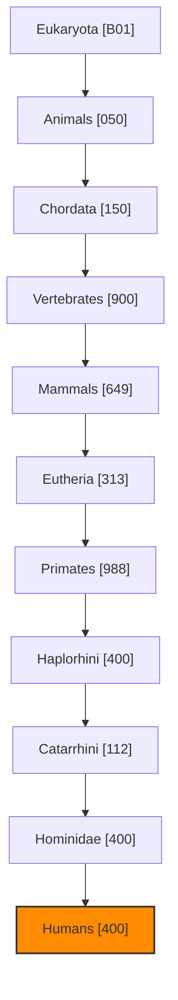
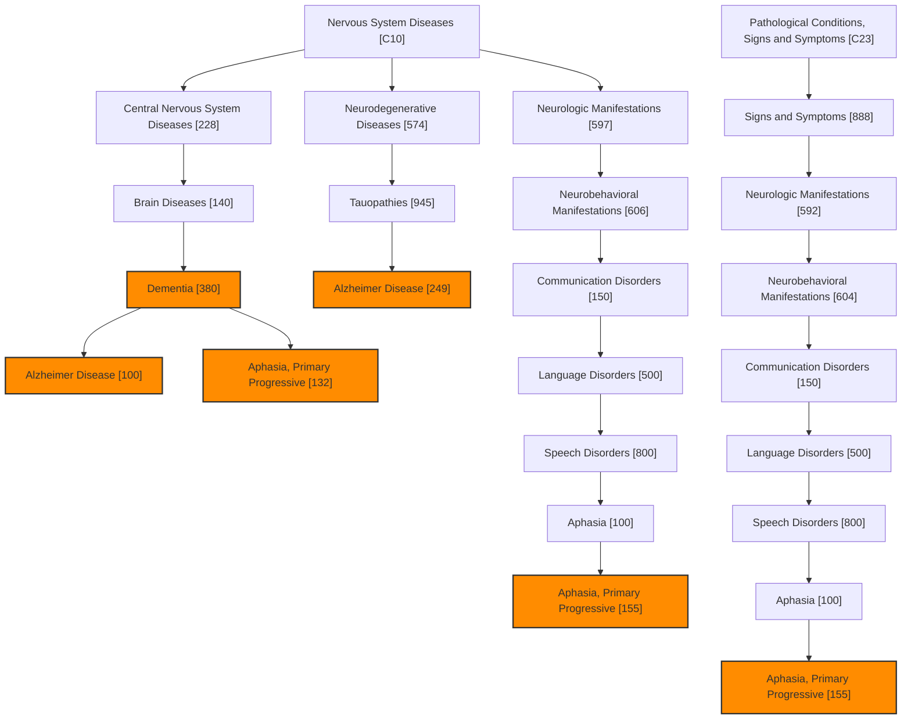
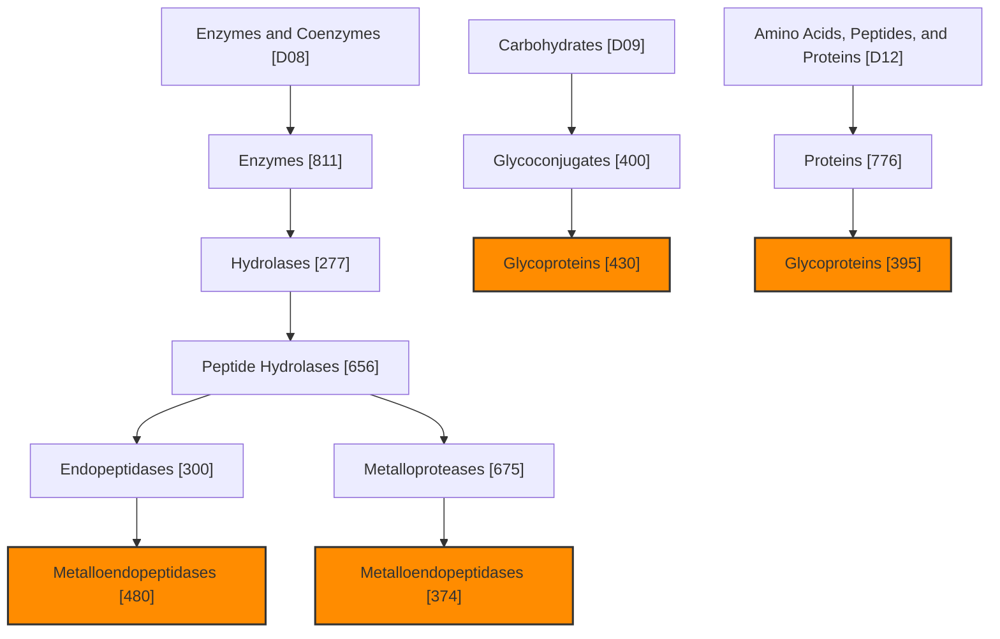
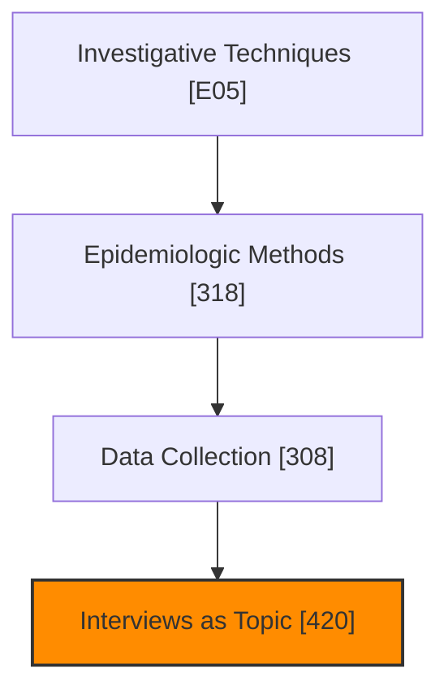
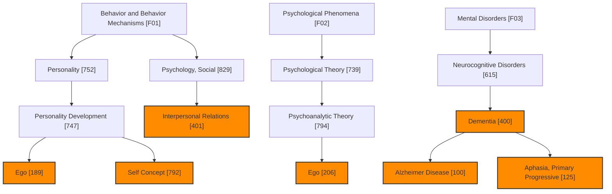
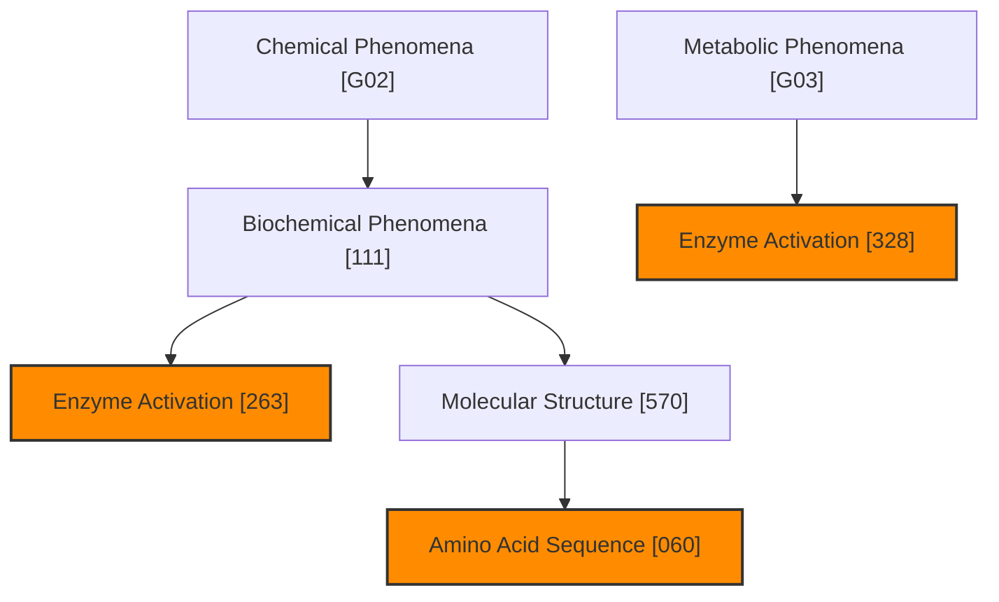
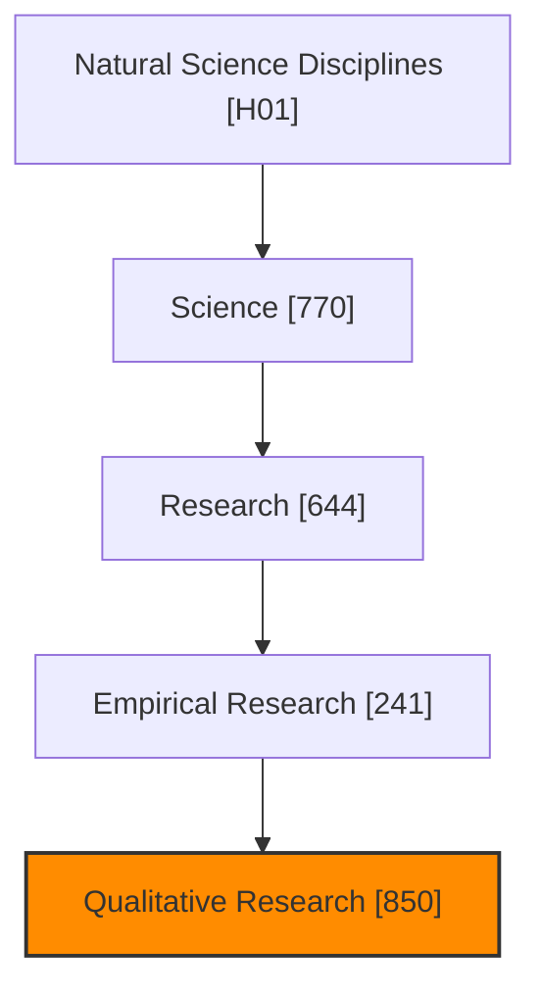
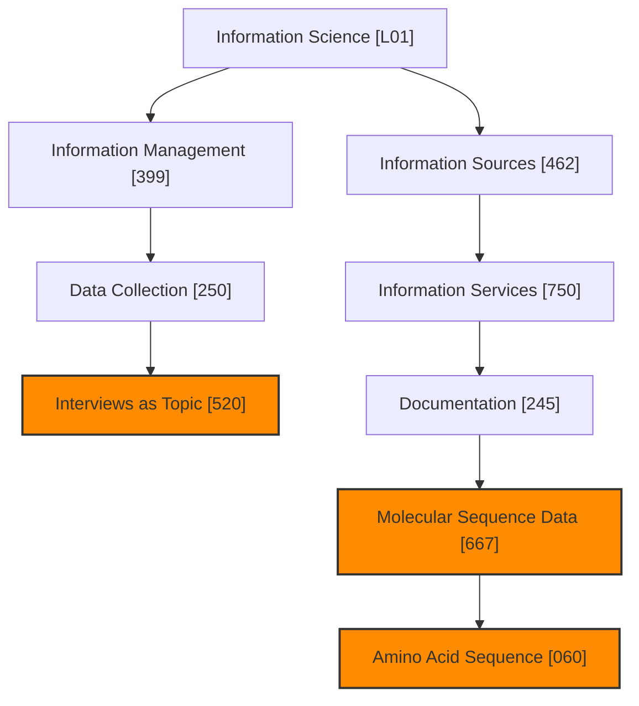
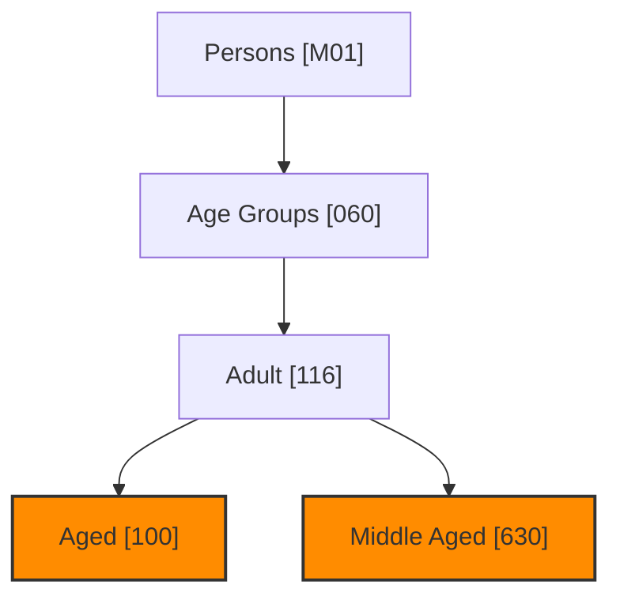
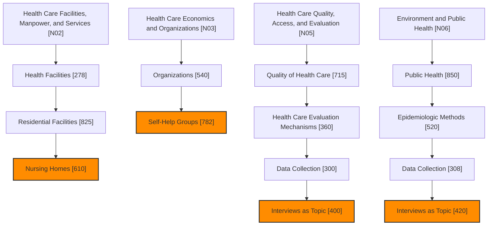

# シードスタディのMeSH用語分析
生成日時: 2025-08-22 03:29:31

## 分析サマリー

- 分析論文数: 5件
- 抽出されたユニークMeSH用語数: 40個

## 主要なMeSH用語（出現頻度順 - 上位20件）

| MeSH UI | MeSH 用語 | 出現数 | 主要トピック論文数 |
|---------|----------|-------|------------------|
| D006801 | Humans | 5 | 0 |
| D008297 | Male | 3 | 0 |
| D007398 | Interpersonal Relations | 2 | 2 |
| D000544 | Alzheimer Disease | 2 | 1 |
| D003704 | Dementia | 2 | 1 |
| D000368 | Aged | 2 | 0 |
| D005260 | Female | 2 | 0 |
| D008875 | Middle Aged | 2 | 0 |
| D036301 | Qualitative Research | 2 | 0 |
| D004532 | Ego | 1 | 1 |
| D012649 | Self Concept | 1 | 1 |
| D018888 | Aphasia, Primary Progressive | 1 | 1 |
| D009735 | Nursing Homes | 1 | 1 |
| D007407 | Interviews as Topic | 1 | 0 |
| D012657 | Self-Help Groups | 1 | 0 |
| D000595 | Amino Acid Sequence | 1 | 0 |
| D004789 | Enzyme Activation | 1 | 0 |
| D006023 | Glycoproteins | 1 | 0 |
| D008666 | Metalloendopeptidases | 1 | 0 |
| D008969 | Molecular Sequence Data | 1 | 0 |

## MeSH用語の階層構造 (上位用語ベース)

以下のMermaid図は、論文から抽出された主要なMeSH用語とその階層構造をカテゴリ別に示しています。
未知の親階層の用語名も可能な限り補完しています。

## カテゴリ B: 生物 (Organisms)

| MeSH UI | MeSH 用語 | 出現数 | ツリー番号 (カテゴリ内) |
|---------|----------|-------|-----------------------|
| D006801 | Humans | 5 | B01.050.150.900.649.313.988.400.112.400.400 |
| D056890 | Eukaryota | 0 | B01 |
| D000818 | Animals | 0 | B01.050 |
| D043344 | Chordata | 0 | B01.050.150 |
| D014714 | Vertebrates | 0 | B01.050.150.900 |
| D008322 | Mammals | 0 | B01.050.150.900.649 |
| D000073566 | Eutheria | 0 | B01.050.150.900.649.313 |
| D011323 | Primates | 0 | B01.050.150.900.649.313.988 |
| D000882 | Haplorhini | 0 | B01.050.150.900.649.313.988.400 |
| D051079 | Catarrhini | 0 | B01.050.150.900.649.313.988.400.112 |
| D015186 | Hominidae | 0 | B01.050.150.900.649.313.988.400.112.400 |

## カテゴリ C: 疾患 (Diseases)

| MeSH UI | MeSH 用語 | 出現数 | ツリー番号 (カテゴリ内) |
|---------|----------|-------|-----------------------|
| D000544 | Alzheimer Disease | 2 | C10.228.140.380.100, C10.574.945.249 |
| D003704 | Dementia | 2 | C10.228.140.380 |
| D018888 | Aphasia, Primary Progressive | 1 | C10.228.140.380.132, C10.597.606.150.500.800.100.155, C23.888.592.604.150.500.800.100.155 |
| D009422 | Nervous System Diseases | 0 | C10 |
| D002493 | Central Nervous System Diseases | 0 | C10.228 |
| D001927 | Brain Diseases | 0 | C10.228.140 |
| D019636 | Neurodegenerative Diseases | 0 | C10.574 |
| D024801 | Tauopathies | 0 | C10.574.945 |
| D009461 | Neurologic Manifestations | 0 | C10.597 |
| D019954 | Neurobehavioral Manifestations | 0 | C10.597.606 |
| D003147 | Communication Disorders | 0 | C10.597.606.150 |
| D007806 | Language Disorders | 0 | C10.597.606.150.500 |
| D013064 | Speech Disorders | 0 | C10.597.606.150.500.800 |
| D001037 | Aphasia | 0 | C10.597.606.150.500.800.100 |
| D013568 | Pathological Conditions, Signs and Symptoms | 0 | C23 |
| D012816 | Signs and Symptoms | 0 | C23.888 |

## カテゴリ D: 化学物質と医薬品 (Chemicals and Drugs)

| MeSH UI | MeSH 用語 | 出現数 | ツリー番号 (カテゴリ内) |
|---------|----------|-------|-----------------------|
| D006023 | Glycoproteins | 1 | D09.400.430, D12.776.395 |
| D008666 | Metalloendopeptidases | 1 | D08.811.277.656.300.480, D08.811.277.656.675.374 |
| D045762 | Enzymes and Coenzymes | 0 | D08 |
| D004798 | Enzymes | 0 | D08.811 |
| D006867 | Hydrolases | 0 | D08.811.277 |
| D010447 | Peptide Hydrolases | 0 | D08.811.277.656 |
| D010450 | Endopeptidases | 0 | D08.811.277.656.300 |
| D045726 | Metalloproteases | 0 | D08.811.277.656.675 |
| D002241 | Carbohydrates | 0 | D09 |
| D006001 | Glycoconjugates | 0 | D09.400 |
| D000602 | Amino Acids, Peptides, and Proteins | 0 | D12 |
| D011506 | Proteins | 0 | D12.776 |

## カテゴリ E: 分析・診断・治療技術と装置 (Techniques and Equipment)

| MeSH UI | MeSH 用語 | 出現数 | ツリー番号 (カテゴリ内) |
|---------|----------|-------|-----------------------|
| D007407 | Interviews as Topic | 1 | E05.318.308.420 |
| D008919 | Investigative Techniques | 0 | E05 |
| D004812 | Epidemiologic Methods | 0 | E05.318 |
| D003625 | Data Collection | 0 | E05.318.308 |

## カテゴリ F: 精神医学と心理学 (Psychiatry and Psychology)

| MeSH UI | MeSH 用語 | 出現数 | ツリー番号 (カテゴリ内) |
|---------|----------|-------|-----------------------|
| D007398 | Interpersonal Relations | 2 | F01.829.401 |
| D000544 | Alzheimer Disease | 2 | F03.615.400.100 |
| D003704 | Dementia | 2 | F03.615.400 |
| D004532 | Ego | 1 | F01.752.747.189, F02.739.794.206 |
| D012649 | Self Concept | 1 | F01.752.747.792 |
| D018888 | Aphasia, Primary Progressive | 1 | F03.615.400.125 |
| D001520 | Behavior and Behavior Mechanisms | 0 | F01 |
| D010551 | Personality | 0 | F01.752 |
| D010553 | Personality Development | 0 | F01.752.747 |
| D011593 | Psychology, Social | 0 | F01.829 |
| D011579 | Psychological Phenomena | 0 | F02 |
| D011582 | Psychological Theory | 0 | F02.739 |
| D011574 | Psychoanalytic Theory | 0 | F02.739.794 |
| D001523 | Mental Disorders | 0 | F03 |
| D019965 | Neurocognitive Disorders | 0 | F03.615 |

## カテゴリ G: 生物学・物理学 (Biological Sciences)

| MeSH UI | MeSH 用語 | 出現数 | ツリー番号 (カテゴリ内) |
|---------|----------|-------|-----------------------|
| D000595 | Amino Acid Sequence | 1 | G02.111.570.060 |
| D004789 | Enzyme Activation | 1 | G02.111.263, G03.328 |
| D055598 | Chemical Phenomena | 0 | G02 |
| D001669 | Biochemical Phenomena | 0 | G02.111 |
| D015394 | Molecular Structure | 0 | G02.111.570 |
| D055754 | Metabolic Phenomena | 0 | G03 |

## カテゴリ H: 自然科学 (Physical Sciences)

| MeSH UI | MeSH 用語 | 出現数 | ツリー番号 (カテゴリ内) |
|---------|----------|-------|-----------------------|
| D036301 | Qualitative Research | 2 | H01.770.644.241.850 |
| D010811 | Natural Science Disciplines | 0 | H01 |
| D012586 | Science | 0 | H01.770 |
| D012106 | Research | 0 | H01.770.644 |
| D036262 | Empirical Research | 0 | H01.770.644.241 |

## カテゴリ L: 情報科学 (Information Science)

| MeSH UI | MeSH 用語 | 出現数 | ツリー番号 (カテゴリ内) |
|---------|----------|-------|-----------------------|
| D007407 | Interviews as Topic | 1 | L01.399.250.520 |
| D000595 | Amino Acid Sequence | 1 | L01.462.750.245.667.060 |
| D008969 | Molecular Sequence Data | 1 | L01.462.750.245.667 |
| D007254 | Information Science | 0 | L01 |
| D019451 | Information Management | 0 | L01.399 |
| D000093983 | Information Sources | 0 | L01.462 |
| D007255 | Information Services | 0 | L01.462.750 |
| D004282 | Documentation | 0 | L01.462.750.245 |

## カテゴリ M: 人物 (Named Groups)

| MeSH UI | MeSH 用語 | 出現数 | ツリー番号 (カテゴリ内) |
|---------|----------|-------|-----------------------|
| D000368 | Aged | 2 | M01.060.116.100 |
| D008875 | Middle Aged | 2 | M01.060.116.630 |
| D009272 | Persons | 0 | M01 |
| D009273 | Age Groups | 0 | M01.060 |
| D000328 | Adult | 0 | M01.060.116 |

## カテゴリ N: 健康管理 (Health Care)

| MeSH UI | MeSH 用語 | 出現数 | ツリー番号 (カテゴリ内) |
|---------|----------|-------|-----------------------|
| D009735 | Nursing Homes | 1 | N02.278.825.610 |
| D007407 | Interviews as Topic | 1 | N05.715.360.300.400, N06.850.520.308.420 |
| D012657 | Self-Help Groups | 1 | N03.540.782 |
| D005159 | Health Care Facilities, Manpower, and Services | 0 | N02 |
| D006268 | Health Facilities | 0 | N02.278 |
| D012112 | Residential Facilities | 0 | N02.278.825 |
| D004472 | Health Care Economics and Organizations | 0 | N03 |
| D009938 | Organizations | 0 | N03.540 |
| D017530 | Health Care Quality, Access, and Evaluation | 0 | N05 |
| D011787 | Quality of Health Care | 0 | N05.715 |
| D017531 | Health Care Evaluation Mechanisms | 0 | N05.715.360 |
| D004778 | Environment and Public Health | 0 | N06 |
| D011634 | Public Health | 0 | N06.850 |

## カテゴリ X: カテゴリ X

| MeSH UI | MeSH 用語 | 出現数 | ツリー番号 (カテゴリ内) |
|---------|----------|-------|-----------------------|
| D008297 | Male | 3 | X999998 |
| D005260 | Female | 2 | X999999 |

### 凡例

- オレンジ色のノード: Seed論文に実際に付与されていたMeSH用語 (上位20件に含まれるもの)
- 通常のノード: 上記MeSH用語の階層を構成する親ノード (可能な場合、用語名を補完)

## 論文別MeSH用語

### PMID: 24776791

- タイトル: Expressed Sense of Self by People With Alzheimer's Disease in a Support Group Interpreted in Terms of Agency and Communion.
- ジャーナル: Journal of applied gerontology : the official journal of the Southern Gerontological Society (2016)
- 著者: Hedman Ragnhild, Hansebo Görel, Ternestedt Britt-Marie, Hellström Ingrid, Norberg Astrid
- MeSH用語数: 11

| MeSH UI | MeSH 用語 | 主要トピック | 修飾語 |
|---------|----------|------------|-------|
| D000368 | Aged | No |  |
| D000544 | Alzheimer Disease | No | psychology* |
| D004532 | Ego | Yes |  |
| D005260 | Female | No |  |
| D006801 | Humans | No |  |
| D007398 | Interpersonal Relations | Yes |  |
| D007407 | Interviews as Topic | No |  |
| D008297 | Male | No |  |
| D008875 | Middle Aged | No |  |
| D012649 | Self Concept | Yes |  |
| D012657 | Self-Help Groups | No |  |

---

### PMID: 1468208

- タイトル: Characterization of metalloproteinases and tissue inhibitors of metalloproteinases in human plasma.
- ジャーナル: Connective tissue research (1992)
- 著者: Moutsiakis D, Mancuso P, Krutzsch H, Stetler-Stevenson W, Zucker S
- MeSH用語数: 9

| MeSH UI | MeSH 用語 | 主要トピック | 修飾語 |
|---------|----------|------------|-------|
| D000595 | Amino Acid Sequence | No |  |
| D004789 | Enzyme Activation | No |  |
| D006023 | Glycoproteins | No | blood* |
| D006801 | Humans | No |  |
| D008666 | Metalloendopeptidases | No | antagonists & inhibitors*, blood*, isolation & purification |
| D008969 | Molecular Sequence Data | No |  |
| D009363 | Neoplasm Proteins | No | blood* |
| D019716 | Tissue Inhibitor of Metalloproteinase-2 | No |  |
| D019714 | Tissue Inhibitor of Metalloproteinases | No |  |

---

### PMID: 36054090

- タイトル: The affective, behavioural, and cognitive reactions to a diagnosis of Primary Progressive Aphasia: A qualitative descriptive study.
- ジャーナル: Dementia (London, England) (2022)
- 著者: Lo Kang-Chi, Bricker-Katz Geraldine, Ballard Kirrie, Piguet Olivier
- MeSH用語数: 6

| MeSH UI | MeSH 用語 | 主要トピック | 修飾語 |
|---------|----------|------------|-------|
| D006801 | Humans | No |  |
| D003704 | Dementia | Yes |  |
| D036301 | Qualitative Research | No |  |
| D005190 | Family | No | psychology |
| D003071 | Cognition | No |  |
| D018888 | Aphasia, Primary Progressive | Yes | diagnosis, psychology |

---

### PMID: 30249213

- タイトル: Meaningful connections in dementia end of life care in long term care homes.
- ジャーナル: BMC psychiatry (2018)
- 著者: McCleary Lynn, Thompson Genevieve N, Venturato Lorraine, Wickson-Griffiths Abigail, Hunter Paulette, Sussman Tamara, Kaasalainen Sharon
- MeSH用語数: 19

| MeSH UI | MeSH 用語 | 主要トピック | 修飾語 |
|---------|----------|------------|-------|
| D000368 | Aged | No |  |
| D000369 | Aged, 80 and over | No |  |
| D001601 | Bereavement | No |  |
| D002170 | Canada | No |  |
| D017028 | Caregivers | No | psychology |
| D003704 | Dementia | No | psychology, therapy* |
| D005195 | Family Relations | No |  |
| D005260 | Female | No |  |
| D017144 | Focus Groups | No |  |
| D006801 | Humans | No |  |
| D007398 | Interpersonal Relations | Yes |  |
| D008134 | Long-Term Care | No | psychology |
| D008297 | Male | No |  |
| D008875 | Middle Aged | No |  |
| D009735 | Nursing Homes | Yes |  |
| D010166 | Palliative Care | No | psychology* |
| D011369 | Professional-Patient Relations | No |  |
| D036301 | Qualitative Research | No |  |
| D013727 | Terminal Care | No | methods, psychology* |

---

### PMID: 33839469

- タイトル: Analytic autoethnography of familial and institutional social identity construction of My Dad with Alzheimer's: In the emergency room with Erving Goffman and Oliver Sacks.
- ジャーナル: Social science & medicine (1982) (2021)
- 著者: Smith Robert Courtney
- MeSH用語数: 8

| MeSH UI | MeSH 用語 | 主要トピック | 修飾語 |
|---------|----------|------------|-------|
| D000328 | Adult | No |  |
| D000544 | Alzheimer Disease | Yes |  |
| D003617 | Dangerous Behavior | No |  |
| D004636 | Emergency Service, Hospital | No |  |
| D004644 | Emotions | No |  |
| D006801 | Humans | No |  |
| D008297 | Male | No |  |
| D012933 | Social Identification | No |  |

---

