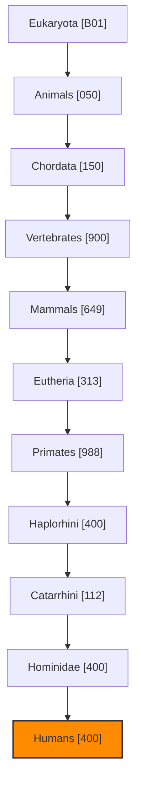
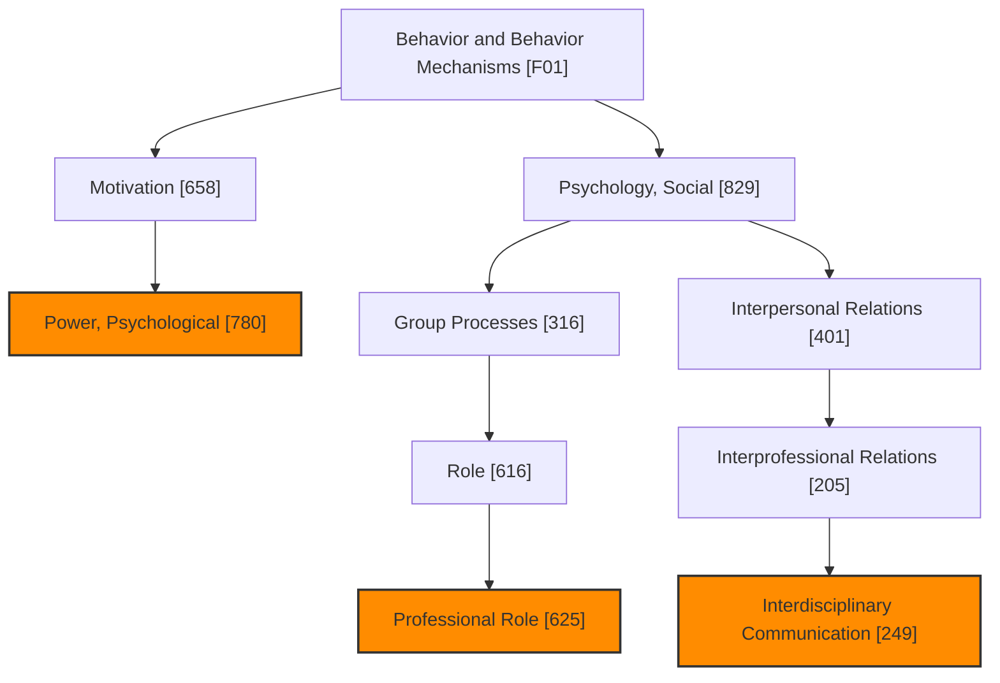
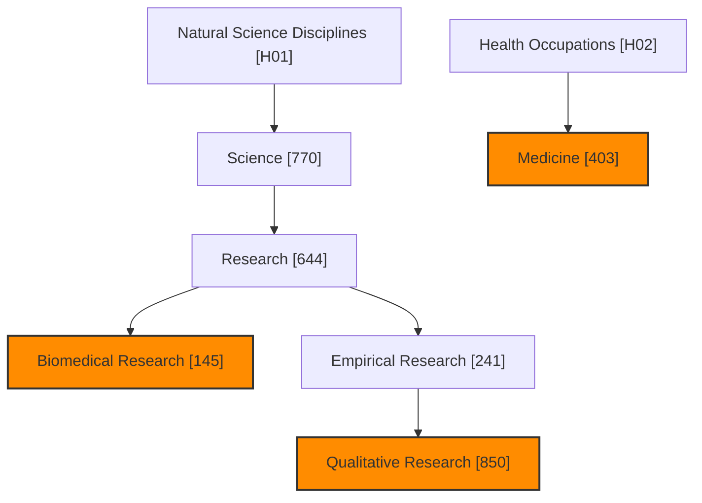
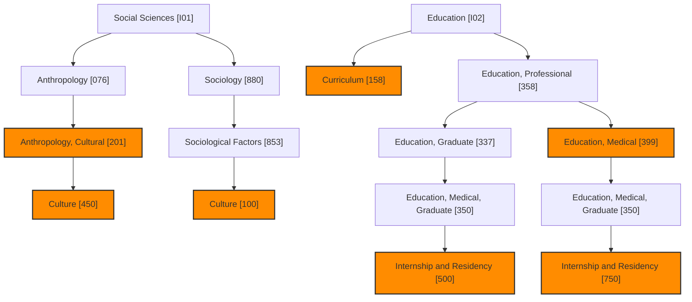
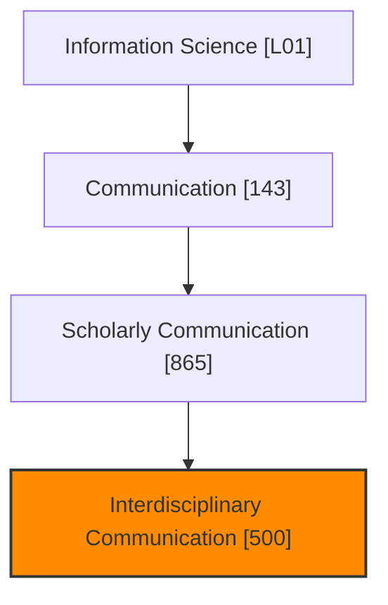
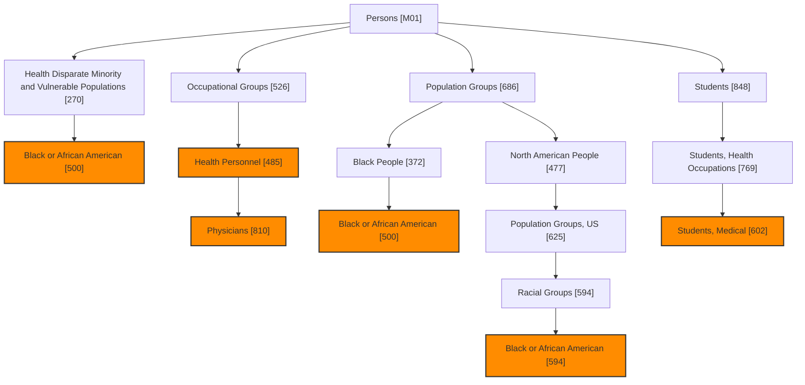
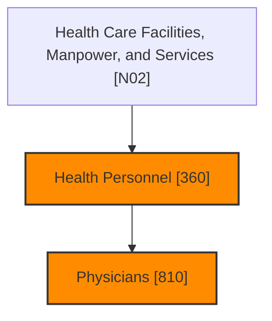
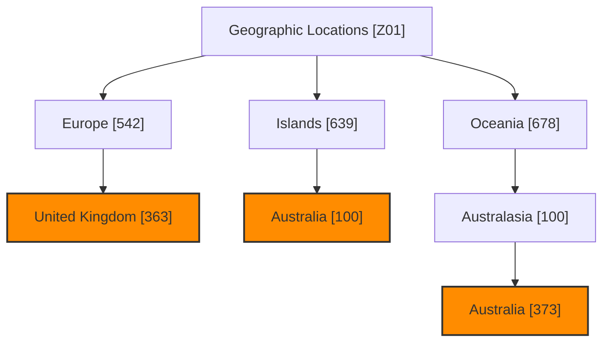

# シードスタディのMeSH用語分析
生成日時: 2025-12-17 07:26:12

## 分析サマリー

- 分析論文数: 46件
- 抽出されたユニークMeSH用語数: 130個

## 主要なMeSH用語（出現頻度順 - 上位20件）

| MeSH UI | MeSH 用語 | 出現数 | 主要トピック論文数 |
|---------|----------|-------|------------------|
| D006801 | Humans | 31 | 0 |
| D000884 | Anthropology, Cultural | 11 | 4 |
| D005260 | Female | 7 | 0 |
| D013337 | Students, Medical | 5 | 3 |
| D036301 | Qualitative Research | 5 | 1 |
| D003479 | Curriculum | 4 | 3 |
| D004501 | Education, Medical | 4 | 3 |
| D008297 | Male | 4 | 0 |
| D010820 | Physicians | 3 | 3 |
| D007396 | Internship and Residency | 3 | 2 |
| D024382 | Professional Role | 3 | 2 |
| D035843 | Biomedical Research | 3 | 2 |
| D006282 | Health Personnel | 3 | 1 |
| D001741 | Black or African American | 3 | 1 |
| D001315 | Australia | 3 | 0 |
| D006113 | United Kingdom | 3 | 0 |
| D003469 | Culture | 2 | 2 |
| D033183 | Interdisciplinary Communication | 2 | 2 |
| D008511 | Medicine | 2 | 2 |
| D011209 | Power, Psychological | 2 | 1 |

## MeSH用語の階層構造 (上位用語ベース)

以下のMermaid図は、論文から抽出された主要なMeSH用語とその階層構造をカテゴリ別に示しています。
未知の親階層の用語名も可能な限り補完しています。

## カテゴリ B: 生物 (Organisms)

| MeSH UI | MeSH 用語 | 出現数 | ツリー番号 (カテゴリ内) |
|---------|----------|-------|-----------------------|
| D006801 | Humans | 31 | B01.050.150.900.649.313.988.400.112.400.400 |
| D056890 | Eukaryota | 0 | B01 |
| D000818 | Animals | 0 | B01.050 |
| D043344 | Chordata | 0 | B01.050.150 |
| D014714 | Vertebrates | 0 | B01.050.150.900 |
| D008322 | Mammals | 0 | B01.050.150.900.649 |
| D000073566 | Eutheria | 0 | B01.050.150.900.649.313 |
| D011323 | Primates | 0 | B01.050.150.900.649.313.988 |
| D000882 | Haplorhini | 0 | B01.050.150.900.649.313.988.400 |
| D051079 | Catarrhini | 0 | B01.050.150.900.649.313.988.400.112 |
| D015186 | Hominidae | 0 | B01.050.150.900.649.313.988.400.112.400 |

## カテゴリ F: 精神医学と心理学 (Psychiatry and Psychology)

| MeSH UI | MeSH 用語 | 出現数 | ツリー番号 (カテゴリ内) |
|---------|----------|-------|-----------------------|
| D024382 | Professional Role | 3 | F01.829.316.616.625 |
| D033183 | Interdisciplinary Communication | 2 | F01.829.401.205.249 |
| D011209 | Power, Psychological | 2 | F01.658.780 |
| D001520 | Behavior and Behavior Mechanisms | 0 | F01 |
| D009042 | Motivation | 0 | F01.658 |
| D011593 | Psychology, Social | 0 | F01.829 |
| D006126 | Group Processes | 0 | F01.829.316 |
| D012380 | Role | 0 | F01.829.316.616 |
| D007398 | Interpersonal Relations | 0 | F01.829.401 |
| D007400 | Interprofessional Relations | 0 | F01.829.401.205 |

## カテゴリ H: 自然科学 (Physical Sciences)

| MeSH UI | MeSH 用語 | 出現数 | ツリー番号 (カテゴリ内) |
|---------|----------|-------|-----------------------|
| D036301 | Qualitative Research | 5 | H01.770.644.241.850 |
| D035843 | Biomedical Research | 3 | H01.770.644.145 |
| D008511 | Medicine | 2 | H02.403 |
| D010811 | Natural Science Disciplines | 0 | H01 |
| D012586 | Science | 0 | H01.770 |
| D012106 | Research | 0 | H01.770.644 |
| D036262 | Empirical Research | 0 | H01.770.644.241 |
| D006281 | Health Occupations | 0 | H02 |

## カテゴリ I: 人類学・教育・社会・社会現象 (Social Phenomena)

| MeSH UI | MeSH 用語 | 出現数 | ツリー番号 (カテゴリ内) |
|---------|----------|-------|-----------------------|
| D000884 | Anthropology, Cultural | 11 | I01.076.201 |
| D003479 | Curriculum | 4 | I02.158 |
| D004501 | Education, Medical | 4 | I02.358.399 |
| D007396 | Internship and Residency | 3 | I02.358.337.350.500, I02.358.399.350.750 |
| D003469 | Culture | 2 | I01.076.201.450, I01.880.853.100 |
| D012942 | Social Sciences | 0 | I01 |
| D000883 | Anthropology | 0 | I01.076 |
| D012961 | Sociology | 0 | I01.880 |
| D066252 | Sociological Factors | 0 | I01.880.853 |
| D004493 | Education | 0 | I02 |
| D004517 | Education, Professional | 0 | I02.358 |
| D004500 | Education, Graduate | 0 | I02.358.337 |
| D004503 | Education, Medical, Graduate | 0 | I02.358.337.350 |

## カテゴリ L: 情報科学 (Information Science)

| MeSH UI | MeSH 用語 | 出現数 | ツリー番号 (カテゴリ内) |
|---------|----------|-------|-----------------------|
| D033183 | Interdisciplinary Communication | 2 | L01.143.865.500 |
| D007254 | Information Science | 0 | L01 |
| D003142 | Communication | 0 | L01.143 |
| D000073820 | Scholarly Communication | 0 | L01.143.865 |

## カテゴリ M: 人物 (Named Groups)

| MeSH UI | MeSH 用語 | 出現数 | ツリー番号 (カテゴリ内) |
|---------|----------|-------|-----------------------|
| D013337 | Students, Medical | 5 | M01.848.769.602 |
| D010820 | Physicians | 3 | M01.526.485.810 |
| D006282 | Health Personnel | 3 | M01.526.485 |
| D001741 | Black or African American | 3 | M01.270.500, M01.686.372.500, M01.686.477.625.594.594 |
| D009272 | Persons | 0 | M01 |
| D000091202 | Health Disparate Minority and Vulnerable Populations | 0 | M01.270 |
| D009274 | Occupational Groups | 0 | M01.526 |
| D044382 | Population Groups | 0 | M01.686 |
| D044383 | Black People | 0 | M01.686.372 |
| D000094858 | North American People | 0 | M01.686.477 |
| D000095165 | Population Groups, US | 0 | M01.686.477.625 |
| D044469 | Racial Groups | 0 | M01.686.477.625.594 |
| D013334 | Students | 0 | M01.848 |
| D013336 | Students, Health Occupations | 0 | M01.848.769 |

## カテゴリ N: 健康管理 (Health Care)

| MeSH UI | MeSH 用語 | 出現数 | ツリー番号 (カテゴリ内) |
|---------|----------|-------|-----------------------|
| D010820 | Physicians | 3 | N02.360.810 |
| D006282 | Health Personnel | 3 | N02.360 |
| D005159 | Health Care Facilities, Manpower, and Services | 0 | N02 |

## カテゴリ X: カテゴリ X

| MeSH UI | MeSH 用語 | 出現数 | ツリー番号 (カテゴリ内) |
|---------|----------|-------|-----------------------|
| D005260 | Female | 7 | X999999 |
| D008297 | Male | 4 | X999998 |

## カテゴリ Z: 地理的な位置 (Geographic Locations)

| MeSH UI | MeSH 用語 | 出現数 | ツリー番号 (カテゴリ内) |
|---------|----------|-------|-----------------------|
| D001315 | Australia | 3 | Z01.639.100, Z01.678.100.373 |
| D006113 | United Kingdom | 3 | Z01.542.363 |
| D005842 | Geographic Locations | 0 | Z01 |
| D005060 | Europe | 0 | Z01.542 |
| D062312 | Islands | 0 | Z01.639 |
| D044349 | Oceania | 0 | Z01.678 |
| D044362 | Australasia | 0 | Z01.678.100 |

### 凡例

- オレンジ色のノード: Seed論文に実際に付与されていたMeSH用語 (上位20件に含まれるもの)
- 通常のノード: 上記MeSH用語の階層を構成する親ノード (可能な場合、用語名を補完)

## 論文別MeSH用語

### PMID: 25921317

- タイトル: Lean leadership: an ethnographic study.
- ジャーナル: Leadership in health services (Bradford, England) (2015)
- 著者: Aij Kjeld Harald, Visse Merel, Widdershoven Guy A M
- MeSH用語数: 10

| MeSH UI | MeSH 用語 | 主要トピック | 修飾語 |
|---------|----------|------------|-------|
| D000046 | Academic Medical Centers | No | organization & administration* |
| D017598 | Efficiency, Organizational | Yes |  |
| D006282 | Health Personnel | Yes | organization & administration, psychology |
| D006801 | Humans | No |  |
| D007407 | Interviews as Topic | No |  |
| D007857 | Leadership | Yes |  |
| D009426 | Netherlands | No |  |
| D011209 | Power, Psychological | No |  |
| D000078329 | Workforce | No |  |
| D017132 | Workplace | No |  |

---

### PMID: 37863646

- タイトル: Creating comics, songs and poems to make sense of decolonising the curriculum: a collaborative autoethnography patchwork.
- ジャーナル: Medical humanities (2024)
- 著者: Al-Jawad Muna, Chawla Gaurish, Singh Neil
- MeSH用語数: 4

| MeSH UI | MeSH 用語 | 主要トピック | 修飾語 |
|---------|----------|------------|-------|
| D006801 | Humans | No |  |
| D003479 | Curriculum | Yes |  |
| D014956 | Writing | Yes |  |
| D009042 | Motivation | No |  |

---

### PMID: 37441757

- タイトル: Fighting Fires and Battling the Clock: Advance Care Planning in Family Medicine Residency.
- ジャーナル: Family medicine (2023)
- 著者: Apramian Tavis, Virag Olivia, Gallagher Erin, Howard Michelle
- MeSH用語数: 5

| MeSH UI | MeSH 用語 | 主要トピック | 修飾語 |
|---------|----------|------------|-------|
| D006801 | Humans | No |  |
| D005194 | Family Practice | No |  |
| D007396 | Internship and Residency | Yes |  |
| D032722 | Advance Care Planning | Yes |  |
| D003142 | Communication | No |  |

---

### PMID: 38295763

- タイトル: The time for patient partnership in medical education has arrived: Critical reflection through autoethnography from a physician turned patient.
- ジャーナル: Medical teacher (2024)
- 著者: Ashdown Lynn, Jones Linda
- MeSH用語数: 7

| MeSH UI | MeSH 用語 | 主要トピック | 修飾語 |
|---------|----------|------------|-------|
| D006801 | Humans | No |  |
| D000884 | Anthropology, Cultural | Yes |  |
| D010817 | Physician-Patient Relations | Yes |  |
| D004501 | Education, Medical | No | organization & administration |
| D018802 | Patient-Centered Care | No |  |
| D010358 | Patient Participation | No |  |
| D018794 | Problem-Based Learning | No |  |

---

### PMID: 32089513

- タイトル: On the "Flip Side": An Autoethnography Utilizing Professional Reflective Practice Skills to Navigate a Medical Experience as the Patient.
- ジャーナル: Journal of medical imaging and radiation sciences (2020)
- 著者: Barry Kym
- MeSH用語数: 8

| MeSH UI | MeSH 用語 | 主要トピック | 修飾語 |
|---------|----------|------------|-------|
| D000328 | Adult | No |  |
| D001315 | Australia | No |  |
| D001932 | Brain Neoplasms | No | diagnosis, psychology*, surgery |
| D005260 | Female | No |  |
| D006801 | Humans | No |  |
| D018802 | Patient-Centered Care | Yes |  |
| D024382 | Professional Role | Yes |  |
| D011369 | Professional-Patient Relations | Yes |  |

---

### PMID: 35998046

- タイトル: Assessing Harmful Bias and Celebrating Strength Through the Narratives of Black/African American Physician Assistant Students.
- ジャーナル: The journal of physician assistant education : the official journal of the Physician Assistant Education Association (2022)
- 著者: Bester Vanessa S, Bradley-Guidry Carolyn
- MeSH用語数: 9

| MeSH UI | MeSH 用語 | 主要トピック | 修飾語 |
|---------|----------|------------|-------|
| D001741 | Black or African American | No |  |
| D001008 | Anxiety Disorders | No |  |
| D000086382 | COVID-19 | Yes | epidemiology |
| D006801 | Humans | No |  |
| D058873 | Pandemics | No |  |
| D010823 | Physician Assistants | Yes | education |
| D012649 | Self Concept | No |  |
| D013334 | Students | No |  |
| D014481 | United States | No |  |

---

### PMID: 40804754

- タイトル: Balancing act: An autoethnographic study of one medical educator's first year as a mentor.
- ジャーナル: Anatomical sciences education (2025)
- 著者: Cale Andrew S
- MeSH用語数: 0

| MeSH UI | MeSH 用語 | 主要トピック | 修飾語 |
|---------|----------|------------|-------|

---

### PMID: 23580139

- タイトル: Behind the scenes of a research and training collaboration: power, privilege, and the hidden transcript of race.
- ジャーナル: Culture, medicine and psychiatry (2013)
- 著者: Carpenter-Song Elizabeth, Whitley Rob
- MeSH用語数: 15

| MeSH UI | MeSH 用語 | 主要トピック | 修飾語 |
|---------|----------|------------|-------|
| D001741 | Black or African American | Yes |  |
| D035843 | Biomedical Research | No | organization & administration* |
| D057191 | Capacity Building | No | organization & administration |
| D003299 | Cooperative Behavior | Yes |  |
| D003469 | Culture | Yes |  |
| D005380 | Financing, Government | No |  |
| D006801 | Humans | No |  |
| D033183 | Interdisciplinary Communication | Yes |  |
| D001523 | Mental Disorders | No | ethnology, rehabilitation |
| D015279 | Organizational Culture | No |  |
| D011209 | Power, Psychological | Yes |  |
| D011570 | Psychiatry | No | education |
| D044469 | Racial Groups | No | psychology* |
| D014481 | United States | No |  |
| D014495 | Universities | No | organization & administration |

---

### PMID: 40974753

- タイトル: Rural resilience: A collaborative autoethnographic study of medical radiation practitioners.
- ジャーナル: Radiography (London, England : 1995) (2025)
- 著者: Chau M T, Spuur K M, Han J
- MeSH用語数: 8

| MeSH UI | MeSH 用語 | 主要トピック | 修飾語 |
|---------|----------|------------|-------|
| D006801 | Humans | No |  |
| D001315 | Australia | No |  |
| D019035 | Rural Health Services | Yes |  |
| D000884 | Anthropology, Cultural | No |  |
| D006297 | Health Services Accessibility | No |  |
| D008297 | Male | No |  |
| D005260 | Female | No |  |
| D001291 | Attitude of Health Personnel | Yes |  |

---

### PMID: 37071765

- タイトル: Practicing Confidence: An Autoethnographic Exploration of the First Years as Physicians.
- ジャーナル: Teaching and learning in medicine (2024)
- 著者: Coret Alon, Perrella Andrew, Regehr Glenn, Farrell Laura
- MeSH用語数: 7

| MeSH UI | MeSH 用語 | 主要トピック | 修飾語 |
|---------|----------|------------|-------|
| D006801 | Humans | No |  |
| D002648 | Child | No |  |
| D002170 | Canada | No |  |
| D010820 | Physicians | Yes |  |
| D007396 | Internship and Residency | Yes |  |
| D006282 | Health Personnel | No |  |
| D007388 | Internal Medicine | No |  |

---

### PMID: 37428343

- タイトル: Applying to medical school with undiagnosed dyslexia: a collaborative autoethnography.
- ジャーナル: Advances in health sciences education : theory and practice (2024)
- 著者: Cornwell Megan, Shaw Sebastian Charles Keith
- MeSH用語数: 8

| MeSH UI | MeSH 用語 | 主要トピック | 修飾語 |
|---------|----------|------------|-------|
| D006801 | Humans | No |  |
| D004410 | Dyslexia | Yes | diagnosis |
| D000884 | Anthropology, Cultural | Yes |  |
| D012577 | Schools, Medical | Yes |  |
| D013337 | Students, Medical | Yes | psychology |
| D006113 | United Kingdom | No |  |
| D005260 | Female | No |  |
| D012570 | School Admission Criteria | No |  |

---

### PMID: 35321417

- タイトル: [Teaching in a pandemic: the transformation of teaching and clinical supervision].
- ジャーナル: Canadian medical education journal (2022)
- 著者: Dubé Tim, Boucher Marie-Christine, Champagne Louise, Garand Marie-Ève, Rinfret Joanie
- MeSH用語数: 0

| MeSH UI | MeSH 用語 | 主要トピック | 修飾語 |
|---------|----------|------------|-------|

---

### PMID: 26383069

- タイトル: Autoethnography: introducing 'I' into medical education research.
- ジャーナル: Medical education (2015)
- 著者: Farrell Laura, Bourgeois-Law Gisele, Regehr Glenn, Ajjawi Rola
- MeSH用語数: 7

| MeSH UI | MeSH 用語 | 主要トピック | 修飾語 |
|---------|----------|------------|-------|
| D000884 | Anthropology, Cultural | Yes |  |
| D001325 | Autobiographies as Topic | No |  |
| D035843 | Biomedical Research | Yes |  |
| D003469 | Culture | Yes |  |
| D003625 | Data Collection | No |  |
| D004501 | Education, Medical | Yes |  |
| D006801 | Humans | No |  |

---

### PMID: 21790691

- タイトル: Who are we when we are doing what we are doing?: the case for mindful embodiment in ethics case consultation.
- ジャーナル: Bioethics (2011)
- 著者: Frolic Andrea
- MeSH用語数: 13

| MeSH UI | MeSH 用語 | 主要トピック | 修飾語 |
|---------|----------|------------|-------|
| D000884 | Anthropology, Cultural | No |  |
| D004644 | Emotions | No |  |
| D028663 | Ethical Theory | No |  |
| D026822 | Ethicists | No |  |
| D033061 | Ethics Consultation | Yes |  |
| D026690 | Ethics, Clinical | Yes |  |
| D006801 | Humans | No |  |
| D007398 | Interpersonal Relations | No |  |
| D019545 | Intuition | No |  |
| D019359 | Knowledge | Yes |  |
| D019222 | Mind-Body Relations, Metaphysical | Yes |  |
| D011057 | Politics | No |  |
| D024382 | Professional Role | Yes |  |

---

### PMID: 20397837

- タイトル: A medical student's perspective of participation in an interprofessional education placement: an autoethnography.
- ジャーナル: Journal of interprofessional care (2010)
- 著者: Gallé Jennifer, Lingard Lorelei
- MeSH用語数: 7

| MeSH UI | MeSH 用語 | 主要トピック | 修飾語 |
|---------|----------|------------|-------|
| D000488 | Allied Health Personnel | No | education* |
| D000884 | Anthropology, Cultural | Yes | methods |
| D002170 | Canada | No |  |
| D006801 | Humans | No |  |
| D033183 | Interdisciplinary Communication | Yes |  |
| D007396 | Internship and Residency | No | organization & administration* |
| D013337 | Students, Medical | No | psychology* |

---

### PMID: 34328273

- タイトル: The bigger picture of shared decision making: A service design perspective using the care path of locally advanced pancreatic cancer as a case.
- ジャーナル: Cancer medicine (2021)
- 著者: Griffioen Ingeborg P M, Rietjens Judith A C, Melles Marijke, Snelders Dirk, Homs Marjolein Y V, van Eijck Casper H, Stiggelbout Anne M
- MeSH用語数: 4

| MeSH UI | MeSH 用語 | 主要トピック | 修飾語 |
|---------|----------|------------|-------|
| D000080536 | Decision Making, Shared | No |  |
| D006801 | Humans | No |  |
| D007406 | Interview, Psychological | No | methods* |
| D010190 | Pancreatic Neoplasms | No | therapy* |

---

### PMID: 37106221

- タイトル: Using collaborative autoethnography to explore the teaching of qualitative research methods in medicine.
- ジャーナル: Advances in health sciences education : theory and practice (2023)
- 著者: Ibrahim Kinda, Weller Susie, Elvidge Elissa, Tavener Meredith
- MeSH用語数: 7

| MeSH UI | MeSH 用語 | 主要トピック | 修飾語 |
|---------|----------|------------|-------|
| D006801 | Humans | No |  |
| D003479 | Curriculum | Yes |  |
| D008511 | Medicine | Yes |  |
| D036301 | Qualitative Research | No |  |
| D013334 | Students | No |  |
| D012107 | Research Design | No |  |
| D013663 | Teaching | No |  |

---

### PMID: 39841689

- タイトル: Expert decision-making in clinicians: An auto-analytic ethnographic study of operational decision-making in urgent care.
- ジャーナル: PloS one (2025)
- 著者: Irvine Nicola, Van Der Meer Robert, Megiddo Itamar
- MeSH用語数: 10

| MeSH UI | MeSH 用語 | 主要トピック | 修飾語 |
|---------|----------|------------|-------|
| D006801 | Humans | No |  |
| D000884 | Anthropology, Cultural | No |  |
| D000066491 | Clinical Decision-Making | Yes |  |
| D000553 | Ambulatory Care | Yes |  |
| D003657 | Decision Making | Yes |  |
| D006113 | United Kingdom | No |  |
| D010820 | Physicians | Yes | psychology |
| D008297 | Male | No |  |
| D005260 | Female | No |  |
| D014218 | Triage | No |  |

---

### PMID: 39044294

- タイトル: An auto-ethnographic study of co-produced health research in a patient organisation: unpacking the good, the bad, and the unspoken.
- ジャーナル: Research involvement and engagement (2024)
- 著者: Janssens Astrid, Drachmann Danielle, Barnes-Cullen Kristy, Carrigg Austin, Christesen Henrik Thybo, Futers Becky, Lavery Yvette Ollada, Palms Tiffany, Petersen Jacob Sten, Shah Pratik, Thornton Paul, Wolfsdorf Joseph
- MeSH用語数: 0

| MeSH UI | MeSH 用語 | 主要トピック | 修飾語 |
|---------|----------|------------|-------|

---

### PMID: 31327981

- タイトル: Student Evaluation of Interprofessional Experiences between Medical and Graduate Biomedical Students.
- ジャーナル: Journal of research in interprofessional practice and education (2019)
- 著者: Levine Corri B, Ansar Maria, Dimet Andrea, Miller Austin, Moon Joon, Rice Christopher, Schaeffer August, Andersson Jourdan, Ekpo-Out Shaunte, McGrath Erica, Sarraj Huda
- MeSH用語数: 0

| MeSH UI | MeSH 用語 | 主要トピック | 修飾語 |
|---------|----------|------------|-------|

---

### PMID: 40780123

- タイトル: "Let's beat cancer together": A hidden curriculum of medical gentrification on the biomedical innovation frontier.
- ジャーナル: Social science & medicine (1982) (2025)
- 著者: Lu Joyce, Kinley Pat M, Feldman Marina
- MeSH用語数: 4

| MeSH UI | MeSH 用語 | 主要トピック | 修飾語 |
|---------|----------|------------|-------|
| D006801 | Humans | No |  |
| D009369 | Neoplasms | Yes | therapy |
| D003479 | Curriculum | Yes |  |
| D000093863 | Residential Segregation | No |  |

---

### PMID: 39874420

- タイトル: Enhancing Reflexivity in Research and Practice in Healthcare Through Oral-Based Autoethnography.
- ジャーナル: Qualitative health research (2025)
- 著者: Mathieu Christopher, Hagelsteen Kristine
- MeSH用語数: 0

| MeSH UI | MeSH 用語 | 主要トピック | 修飾語 |
|---------|----------|------------|-------|

---

### PMID: 41055357

- タイトル: An autoethnographic critique of a past report of inpatient psychiatric treatment for gender diverse children.
- ジャーナル: The Medical journal of Australia (2025)
- 著者: McFadyen Jayne, Jones Timothy W, Koek Rowena, Harte Fintan, Jansen Brendan, Galbally Megan, Kealy-Bateman Warren, Wall Catherine, McLamore Quinnehtukqut, Ravine Anja
- MeSH用語数: 11

| MeSH UI | MeSH 用語 | 主要トピック | 修飾語 |
|---------|----------|------------|-------|
| D000293 | Adolescent | No |  |
| D002648 | Child | No |  |
| D005260 | Female | No |  |
| D006801 | Humans | No |  |
| D008297 | Male | No |  |
| D000068116 | Gender Dysphoria | Yes | therapy, psychology |
| D005783 | Gender Identity | No |  |
| D006778 | Hospitals, Psychiatric | No |  |
| D007297 | Inpatients | No | psychology |
| D012189 | Retrospective Studies | No |  |
| D063106 | Transgender Persons | Yes | psychology |

---

### PMID: 36301374

- タイトル: Rethinking professional identity formation amidst protests and social upheaval: a journey in Africa.
- ジャーナル: Advances in health sciences education : theory and practice (2023)
- 著者: Mokhachane Mantoa, George Ann, Wyatt Tasha, Kuper Ayelet, Green-Thompson Lionel
- MeSH用語数: 6

| MeSH UI | MeSH 用語 | 主要トピック | 修飾語 |
|---------|----------|------------|-------|
| D006801 | Humans | No |  |
| D005260 | Female | No |  |
| D012933 | Social Identification | Yes |  |
| D013337 | Students, Medical | Yes |  |
| D000349 | Africa | No |  |
| D010684 | Philosophy | No |  |

---

### PMID: 40580992

- タイトル: Including Indigenous knowledge in biomedical research: a co-autoethnography.
- ジャーナル: The Lancet. Global health (2025)
- 著者: O'Brien Jessica, Walker Toni, Gutman Sarah J, Wade Vicki, Taylor Andrew J, Adams Karen
- MeSH用語数: 4

| MeSH UI | MeSH 用語 | 主要トピック | 修飾語 |
|---------|----------|------------|-------|
| D006801 | Humans | No |  |
| D035843 | Biomedical Research | Yes |  |
| D036301 | Qualitative Research | No |  |
| D000884 | Anthropology, Cultural | No |  |

---

### PMID: 39318910

- タイトル: Deepening the Understanding of Inflammatory Conditions Through Rheumatology Education in Family Medicine: An Autoethnography.
- ジャーナル: Cureus (2024)
- 著者: Ohta Ryuichi, Sano Chiaki
- MeSH用語数: 0

| MeSH UI | MeSH 用語 | 主要トピック | 修飾語 |
|---------|----------|------------|-------|

---

### PMID: 39119414

- タイトル: The Quality of Family Medicine Team Conferences Through the Lens of a Director: An Autoethnography.
- ジャーナル: Cureus (2024)
- 著者: Ohta Ryuichi, Sano Chiaki
- MeSH用語数: 0

| MeSH UI | MeSH 用語 | 主要トピック | 修飾語 |
|---------|----------|------------|-------|

---

### PMID: 38601119

- タイトル: Comparison of OBGYN postgraduate curricula and assessment methods between Canada and the Netherlands: an auto-ethnographic study.
- ジャーナル: Frontiers in medicine (2024)
- 著者: Paternotte Emma, Dijksterhuis Marja, Goverde Angelique, Ezzat Hanna, Scheele Fedde
- MeSH用語数: 0

| MeSH UI | MeSH 用語 | 主要トピック | 修飾語 |
|---------|----------|------------|-------|

---

### PMID: 33646883

- タイトル: Capturing the Moments: An Autoethnographic Exploration of Self-Preservation in Clerkship.
- ジャーナル: Teaching and learning in medicine (2021)
- 著者: Perrella Andrew, Coret Alon, Regehr Glenn, Farrell Laura Marie
- MeSH用語数: 6

| MeSH UI | MeSH 用語 | 主要トピック | 修飾語 |
|---------|----------|------------|-------|
| D002055 | Burnout, Professional | Yes |  |
| D002982 | Clinical Clerkship | Yes |  |
| D003479 | Curriculum | No |  |
| D004501 | Education, Medical | Yes |  |
| D006801 | Humans | No |  |
| D013337 | Students, Medical | Yes |  |

---

### PMID: 24261091

- タイトル: The role of the surgical care practitioner within the surgical team.
- ジャーナル: British journal of nursing (Mark Allen Publishing) ()
- 著者: Quick Julie
- MeSH用語数: 10

| MeSH UI | MeSH 用語 | 主要トピック | 修飾語 |
|---------|----------|------------|-------|
| D003299 | Cooperative Behavior | No |  |
| D006801 | Humans | No |  |
| D024802 | Nurse's Role | Yes |  |
| D010348 | Patient Care Team | Yes |  |
| D017060 | Patient Satisfaction | No |  |
| D013527 | Perioperative Nursing | Yes |  |
| D013514 | Surgical Procedures, Operative | Yes |  |
| D016896 | Treatment Outcome | No |  |
| D006113 | United Kingdom | No |  |
| D000078329 | Workforce | No |  |

---

### PMID: 38586691

- タイトル: Psychiatrists' Illustration of Awe in Empathic Listening Assessments: A Pilot Study.
- ジャーナル: Cureus (2024)
- 著者: Ramakrishnan Parameshwaran, Brod Thomas M, Lowder Thomas, Padala Prasad R
- MeSH用語数: 0

| MeSH UI | MeSH 用語 | 主要トピック | 修飾語 |
|---------|----------|------------|-------|

---

### PMID: 32292191

- タイトル: Overview and Prospect of Autoethnography in Pharmacy Education and Practice.
- ジャーナル: American journal of pharmaceutical education (2020)
- 著者: Ramalho-de-Oliveira Djenane
- MeSH用語数: 7

| MeSH UI | MeSH 用語 | 主要トピック | 修飾語 |
|---------|----------|------------|-------|
| D004512 | Education, Pharmacy | No | methods* |
| D006801 | Humans | No |  |
| D010595 | Pharmacists | No |  |
| D010604 | Pharmacy | No | methods |
| D010607 | Pharmacy Service, Hospital | No | methods* |
| D024382 | Professional Role | No |  |
| D013339 | Students, Pharmacy | No |  |

---

### PMID: 40204360

- タイトル: Teaching health systems leadership and innovation to physicians.
- ジャーナル: BMJ leader (2025)
- 著者: Ratnapalan Savithiri, Sriharan Abi, Anderson Geoffrey, Dubinsky Isser, Chan Benjamin Tb, Smith Tina, Allin Sara, Sen Devrim, Lopez Christina, Downie-Ross Zoe, Nadarajah Ajantha, Laporte Audrey
- MeSH用語数: 0

| MeSH UI | MeSH 用語 | 主要トピック | 修飾語 |
|---------|----------|------------|-------|

---

### PMID: 29921274

- タイトル: Simple rules for evidence translation in complex systems: A qualitative study.
- ジャーナル: BMC medicine (2018)
- 著者: Reed Julie E, Howe Cathy, Doyle Cathal, Bell Derek
- MeSH用語数: 3

| MeSH UI | MeSH 用語 | 主要トピック | 修飾語 |
|---------|----------|------------|-------|
| D003695 | Delivery of Health Care | No | trends* |
| D006801 | Humans | No |  |
| D036301 | Qualitative Research | Yes |  |

---

### PMID: 36263266

- タイトル: Continuous quality improvement at the frontline: One interdisciplinary clinical team's four-year journey after completing a virtual learning program.
- ジャーナル: Learning health systems (2022)
- 著者: Robinson Claire H, Thompto Amy J, Lima Elizabeth N, Damschroder Laura J
- MeSH用語数: 0

| MeSH UI | MeSH 用語 | 主要トピック | 修飾語 |
|---------|----------|------------|-------|

---

### PMID: 31637638

- タイトル: Compassion in the Clinical Context: Constrained, Distributed, and Adaptive.
- ジャーナル: Journal of general internal medicine (2020)
- 著者: Roze des Ordons Amanda L, MacIsaac Lori, Hui Jacqueline, Everson Joanna, Ellaway Rachel H
- MeSH用語数: 6

| MeSH UI | MeSH 用語 | 主要トピック | 修飾語 |
|---------|----------|------------|-------|
| D004645 | Empathy | Yes |  |
| D017144 | Focus Groups | No |  |
| D066296 | Grounded Theory | No |  |
| D006801 | Humans | No |  |
| D010166 | Palliative Care | Yes |  |
| D036301 | Qualitative Research | No |  |

---

### PMID: 39698130

- タイトル: A scoping review of autoethnography in nursing.
- ジャーナル: International journal of nursing sciences (2024)
- 著者: Salzmann-Erikson Martin
- MeSH用語数: 0

| MeSH UI | MeSH 用語 | 主要トピック | 修飾語 |
|---------|----------|------------|-------|

---

### PMID: 29442206

- タイトル: Thrown into the world of independent practice: from unexpected uncertainty to new identities.
- ジャーナル: Advances in health sciences education : theory and practice (2018)
- 著者: Schrewe Brett
- MeSH用語数: 6

| MeSH UI | MeSH 用語 | 主要トピック | 修飾語 |
|---------|----------|------------|-------|
| D000884 | Anthropology, Cultural | No |  |
| D001007 | Anxiety | No | psychology |
| D001291 | Attitude of Health Personnel | No |  |
| D002983 | Clinical Competence | Yes |  |
| D006801 | Humans | No |  |
| D000072143 | Pediatricians | No | psychology*, standards* |

---

### PMID: 29749018

- タイトル: The experiences of medical students with dyslexia: An interpretive phenomenological study.
- ジャーナル: Dyslexia (Chichester, England) (2018)
- 著者: Shaw Sebastian C K, Anderson John L
- MeSH用語数: 12

| MeSH UI | MeSH 用語 | 主要トピック | 修飾語 |
|---------|----------|------------|-------|
| D000328 | Adult | No |  |
| D000884 | Anthropology, Cultural | No | methods |
| D058445 | Bullying | No |  |
| D004410 | Dyslexia | No | psychology* |
| D004644 | Emotions | No |  |
| D005260 | Female | No |  |
| D006801 | Humans | No |  |
| D007407 | Interviews as Topic | No |  |
| D008297 | Male | No |  |
| D036301 | Qualitative Research | No |  |
| D013337 | Students, Medical | No | psychology* |
| D055815 | Young Adult | No |  |

---

### PMID: 40612428

- タイトル: A psychiatrist in training encounters a traditional healer.
- ジャーナル: The South African journal of psychiatry : SAJP : the journal of the Society of Psychiatrists of South Africa (2025)
- 著者: Singh Raksha, Joubert Pierre M
- MeSH用語数: 0

| MeSH UI | MeSH 用語 | 主要トピック | 修飾語 |
|---------|----------|------------|-------|

---

### PMID: 35967972

- タイトル: Honoring Black Hopes: How to respond when the family is hoping for a miracle.
- ジャーナル: F1000Research (2022)
- 著者: Stonestreet John
- MeSH用語数: 6

| MeSH UI | MeSH 用語 | 主要トピック | 修飾語 |
|---------|----------|------------|-------|
| D001741 | Black or African American | No |  |
| D003142 | Communication | No |  |
| D003643 | Death | No |  |
| D006801 | Humans | No |  |
| D010820 | Physicians | Yes |  |
| D029181 | Spirituality | Yes |  |

---

### PMID: 38298812

- タイトル: Why did he say that? Teaching physicians-in-training how to recognize hidden emotions in end-of-life prognosis conversations: an autoethnography.
- ジャーナル: MedEdPublish (2016) (2022)
- 著者: Stonestreet John
- MeSH用語数: 0

| MeSH UI | MeSH 用語 | 主要トピック | 修飾語 |
|---------|----------|------------|-------|

---

### PMID: 40748528

- タイトル: The Artist Mindset: A Collaborative Autoethnography by a Poet and a Psychiatrist.
- ジャーナル: The Journal of medical humanities (2025)
- 著者: Taniguchi Yuko, Cullen Kathryn
- MeSH用語数: 0

| MeSH UI | MeSH 用語 | 主要トピック | 修飾語 |
|---------|----------|------------|-------|

---

### PMID: 35886138

- タイトル: What Is an Extreme Sports Healthcare Provider: An Auto-Ethnographic Study of the Development of an Extreme Sports Medicine Training Program.
- ジャーナル: International journal of environmental research and public health (2022)
- 著者: Trease Larissa, Albert Edi, Singleman Glenn, Brymer Eric
- MeSH用語数: 7

| MeSH UI | MeSH 用語 | 主要トピック | 修飾語 |
|---------|----------|------------|-------|
| D056352 | Athletes | No |  |
| D001265 | Athletic Injuries | Yes |  |
| D001315 | Australia | No |  |
| D006282 | Health Personnel | No |  |
| D006801 | Humans | No |  |
| D013177 | Sports | Yes |  |
| D013178 | Sports Medicine | Yes |  |

---

### PMID: 38753500

- タイトル: Which Ethnography? Whose Ethnography? Medical anthropology's Epistemic Sensibilities Among Health Ethnographies.
- ジャーナル: Medical anthropology (2024)
- 著者: Trundle Catherine, Phillips Tarryn
- MeSH用語数: 4

| MeSH UI | MeSH 用語 | 主要トピック | 修飾語 |
|---------|----------|------------|-------|
| D060432 | Anthropology, Medical | Yes |  |
| D006801 | Humans | No |  |
| D000884 | Anthropology, Cultural | No |  |
| D019359 | Knowledge | No |  |

---

### PMID: 37378634

- タイトル: Editors as Gatekeepers: One Medical Education Journal's Efforts to Resist Racism in Scholarly Publishing.
- ジャーナル: Academic medicine : journal of the Association of American Medical Colleges (2023)
- 著者: Wyatt Tasha R, Bullock Justin L, Andon Anabelle, Odukoya Erica J, Torres Carlos G, Gingell Gareth, Han Heeyoung, Zaidi Zareen, Mylona Elza, Torre Dario, Cianciolo Anna T
- MeSH用語数: 6

| MeSH UI | MeSH 用語 | 主要トピック | 修飾語 |
|---------|----------|------------|-------|
| D006801 | Humans | No |  |
| D000073820 | Scholarly Communication | No |  |
| D063505 | Racism | Yes | prevention & control |
| D004501 | Education, Medical | Yes |  |
| D008511 | Medicine | Yes |  |
| D010380 | Peer Review | No |  |

---

