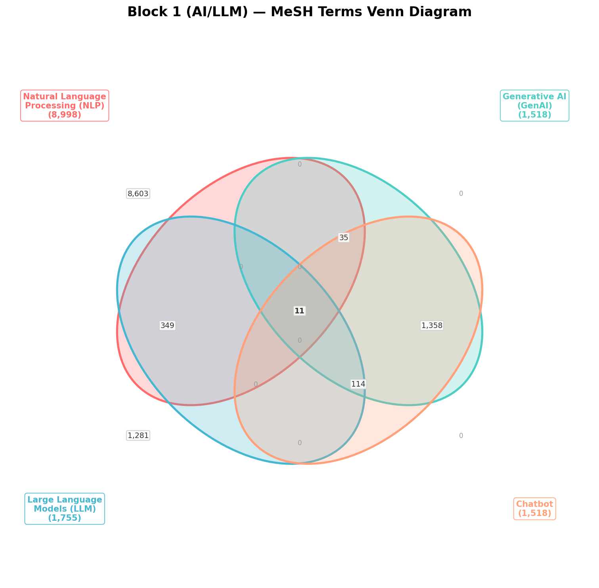

<!--
Generated by: projects/kondo_wba/mesh_venn_block1.py
Generated on: 2026-02-16 05:33:28
-->

# Block 1 (AI/LLM) MeSH用語 ベン図分析

## 対象MeSH用語

| Label | MeSH用語 | 単独件数 |
|-------|----------|---------|
| NLP | `"Natural Language Processing"[mh]` | 8,998 |
| GenAI | `"Generative Artificial Intelligence"[mh]` | 1,518 |
| LLM | `"Large Language Models"[mh]` | 1,755 |
| Chatbot | `Chatbot[mh]` | 1,518 |

## 全組み合わせの件数

| 組み合わせ | PubMed件数 |
|-----------|-----------|
| NLP | 8,998 |
| GenAI | 1,518 |
| LLM | 1,755 |
| Chatbot | 1,518 |
| NLP ∩ GenAI | 46 |
| NLP ∩ LLM | 360 |
| NLP ∩ Chatbot | 46 |
| GenAI ∩ LLM | 125 |
| GenAI ∩ Chatbot | 1,518 |
| LLM ∩ Chatbot | 125 |
| NLP ∩ GenAI ∩ LLM | 11 |
| NLP ∩ GenAI ∩ Chatbot | 46 |
| NLP ∩ LLM ∩ Chatbot | 11 |
| GenAI ∩ LLM ∩ Chatbot | 125 |
| NLP ∩ GenAI ∩ LLM ∩ Chatbot | 11 |
| **全体 (OR結合)** | **11,751** |

## 排他的領域の件数（包除原理）

| 領域 | 排他的件数 |
|------|-----------|
| NLP only | 8,603 |
| GenAI only | 0 |
| NLP ∩ GenAI only | 0 |
| LLM only | 1,281 |
| NLP ∩ LLM only | 349 |
| GenAI ∩ LLM only | 0 |
| NLP ∩ GenAI ∩ LLM only | 0 |
| Chatbot only | 0 |
| NLP ∩ Chatbot only | 0 |
| GenAI ∩ Chatbot only | 1,358 |
| NLP ∩ GenAI ∩ Chatbot only | 35 |
| LLM ∩ Chatbot only | 0 |
| NLP ∩ LLM ∩ Chatbot only | 0 |
| GenAI ∩ LLM ∩ Chatbot only | 114 |
| NLP ∩ GenAI ∩ LLM ∩ Chatbot only | 11 |
| **合計** | **11,751** |

## 整合性チェック

✅ 排他的領域の合計 (11,751) = 全体OR件数 (11,751) — **一致**

## ベン図

