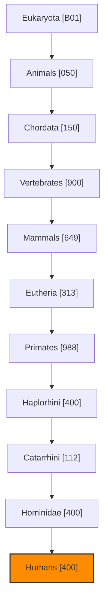
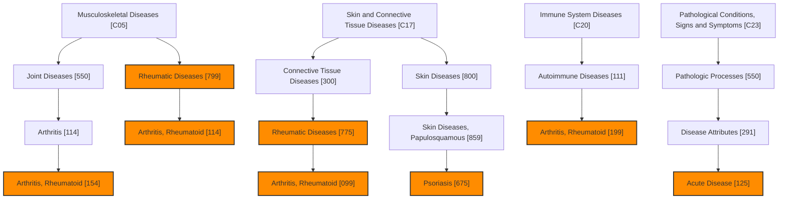
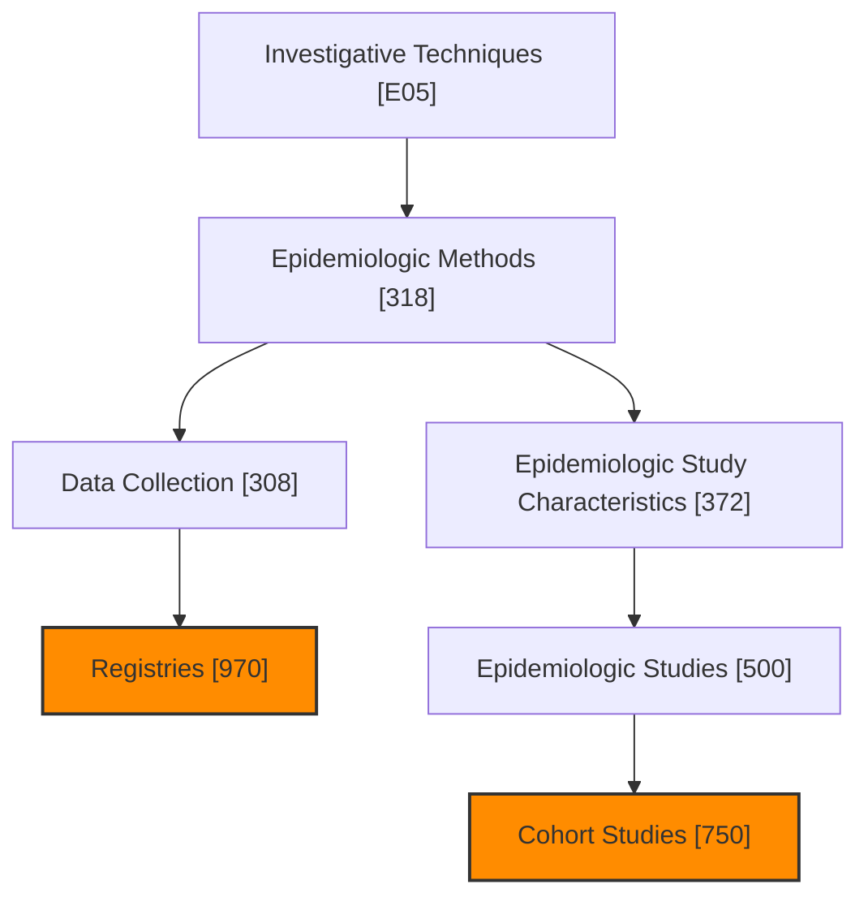
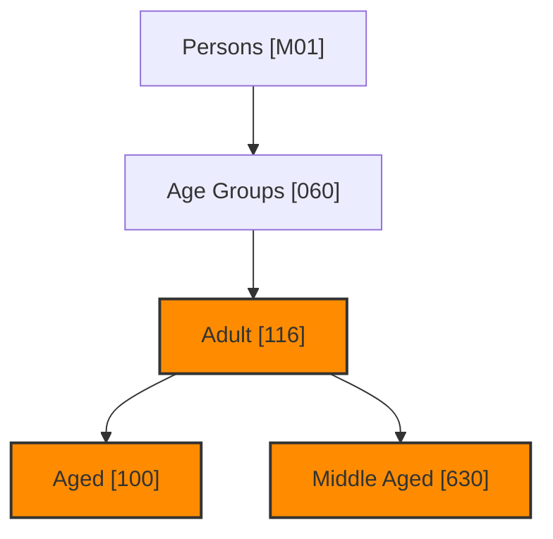
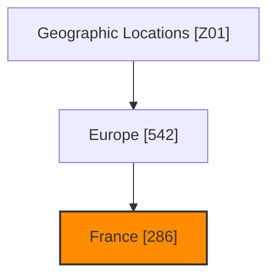

# シードスタディのMeSH用語分析
生成日時: 2026-03-01 09:39:29

## 分析サマリー

- 分析論文数: 4件
- 抽出されたユニークMeSH用語数: 40個

## 主要なMeSH用語（出現頻度順 - 上位20件）

| MeSH UI | MeSH 用語 | 出現数 | 主要トピック論文数 |
|---------|----------|-------|------------------|
| D005260 | Female | 4 | 0 |
| D006801 | Humans | 4 | 0 |
| D008297 | Male | 4 | 0 |
| D008875 | Middle Aged | 4 | 0 |
| D000368 | Aged | 3 | 0 |
| D011565 | Psoriasis | 3 | 0 |
| D000328 | Adult | 3 | 0 |
| D012042 | Registries | 2 | 1 |
| D001172 | Arthritis, Rheumatoid | 2 | 0 |
| D005602 | France | 2 | 0 |
| D000069283 | Rituximab | 2 | 0 |
| D061067 | Antibodies, Monoclonal, Humanized | 2 | 0 |
| D000208 | Acute Disease | 1 | 0 |
| D058846 | Antibodies, Monoclonal, Murine-Derived | 1 | 0 |
| D018501 | Antirheumatic Agents | 1 | 0 |
| D015331 | Cohort Studies | 1 | 0 |
| D007155 | Immunologic Factors | 1 | 0 |
| D012216 | Rheumatic Diseases | 1 | 0 |
| D014409 | Tumor Necrosis Factor-alpha | 1 | 0 |
| D000068879 | Adalimumab | 1 | 0 |

## MeSH用語の階層構造 (上位用語ベース)

以下のMermaid図は、論文から抽出された主要なMeSH用語とその階層構造をカテゴリ別に示しています。
未知の親階層の用語名も可能な限り補完しています。

## カテゴリ B: 生物 (Organisms)

| MeSH UI | MeSH 用語 | 出現数 | ツリー番号 (カテゴリ内) |
|---------|----------|-------|-----------------------|
| D006801 | Humans | 4 | B01.050.150.900.649.313.988.400.112.400.400 |
| D056890 | Eukaryota | 0 | B01 |
| D000818 | Animals | 0 | B01.050 |
| D043344 | Chordata | 0 | B01.050.150 |
| D014714 | Vertebrates | 0 | B01.050.150.900 |
| D008322 | Mammals | 0 | B01.050.150.900.649 |
| D000073566 | Eutheria | 0 | B01.050.150.900.649.313 |
| D011323 | Primates | 0 | B01.050.150.900.649.313.988 |
| D000882 | Haplorhini | 0 | B01.050.150.900.649.313.988.400 |
| D051079 | Catarrhini | 0 | B01.050.150.900.649.313.988.400.112 |
| D015186 | Hominidae | 0 | B01.050.150.900.649.313.988.400.112.400 |

## カテゴリ C: 疾患 (Diseases)

| MeSH UI | MeSH 用語 | 出現数 | ツリー番号 (カテゴリ内) |
|---------|----------|-------|-----------------------|
| D011565 | Psoriasis | 3 | C17.800.859.675 |
| D001172 | Arthritis, Rheumatoid | 2 | C05.550.114.154, C05.799.114, C17.300.775.099, C20.111.199 |
| D000208 | Acute Disease | 1 | C23.550.291.125 |
| D012216 | Rheumatic Diseases | 1 | C05.799, C17.300.775 |
| D009140 | Musculoskeletal Diseases | 0 | C05 |
| D007592 | Joint Diseases | 0 | C05.550 |
| D001168 | Arthritis | 0 | C05.550.114 |
| D017437 | Skin and Connective Tissue Diseases | 0 | C17 |
| D003240 | Connective Tissue Diseases | 0 | C17.300 |
| D012871 | Skin Diseases | 0 | C17.800 |
| D017444 | Skin Diseases, Papulosquamous | 0 | C17.800.859 |
| D007154 | Immune System Diseases | 0 | C20 |
| D001327 | Autoimmune Diseases | 0 | C20.111 |
| D013568 | Pathological Conditions, Signs and Symptoms | 0 | C23 |
| D010335 | Pathologic Processes | 0 | C23.550 |
| D020969 | Disease Attributes | 0 | C23.550.291 |

## カテゴリ D: 化学物質と医薬品 (Chemicals and Drugs)

```mermaid
flowchart TD
    node_D09["Carbohydrates [D09]"]
    node_D09_400["Glycoconjugates [400]"]
    node_D09_400_430["Glycoproteins [430]"]
    node_D09_400_430_965["Tumor Necrosis Factor-alpha [965]"]
    node_D12["Amino Acids, Peptides, and Proteins [D12]"]
    node_D12_644["Peptides [644]"]
    node_D12_644_276["Intercellular Signaling Peptides and Proteins [276]"]
    node_D12_644_276_374["Cytokines [374]"]
    node_D12_644_276_374_500["Monokines [500]"]
    node_D12_644_276_374_500_800["Tumor Necrosis Factor-alpha [800]"]
    node_D12_644_276_374_750["Tumor Necrosis Factors [750]"]
    node_D12_644_276_374_750_626["Tumor Necrosis Factor-alpha [626]"]
    node_D12_776["Proteins [776]"]
    node_D12_776_124["Blood Proteins [124]"]
    node_D12_776_124_486["Immunoproteins [486]"]
    node_D12_776_124_486_485["Immunoglobulins [485]"]
    node_D12_776_124_486_485_114["Antibodies [114]"]
    node_D12_776_124_486_485_114_224["Antibodies, Monoclonal [224]"]
    node_D12_776_124_486_485_114_224_060["Antibodies, Monoclonal, Humanized [060]"]
    node_D12_776_124_486_485_114_224_060_250["Adalimumab [250]"]
    node_D12_776_124_486_485_114_224_075["Antibodies, Monoclonal, Murine-Derived [075]"]
    node_D12_776_124_486_485_114_224_075_785["Rituximab [785]"]
    node_D12_776_124_790["Serum Globulins [790]"]
    node_D12_776_124_790_651["Immunoglobulins [651]"]
    node_D12_776_124_790_651_114["Antibodies [114]"]
    node_D12_776_124_790_651_114_224["Antibodies, Monoclonal [224]"]
    node_D12_776_124_790_651_114_224_060["Antibodies, Monoclonal, Humanized [060]"]
    node_D12_776_124_790_651_114_224_060_250["Adalimumab [250]"]
    node_D12_776_124_790_651_114_224_075["Antibodies, Monoclonal, Murine-Derived [075]"]
    node_D12_776_124_790_651_114_224_075_785["Rituximab [785]"]
    node_D12_776_124_900["Tumor Necrosis Factor-alpha [900]"]
    node_D12_776_377["Globulins [377]"]
    node_D12_776_377_715["Serum Globulins [715]"]
    node_D12_776_377_715_548["Immunoglobulins [548]"]
    node_D12_776_377_715_548_114["Antibodies [114]"]
    node_D12_776_377_715_548_114_224["Antibodies, Monoclonal [224]"]
    node_D12_776_377_715_548_114_224_200["Antibodies, Monoclonal, Humanized [200]"]
    node_D12_776_377_715_548_114_224_200_250["Adalimumab [250]"]
    node_D12_776_377_715_548_114_224_284["Antibodies, Monoclonal, Murine-Derived [284]"]
    node_D12_776_377_715_548_114_224_284_785["Rituximab [785]"]
    node_D12_776_395["Glycoproteins [395]"]
    node_D12_776_395_930["Tumor Necrosis Factor-alpha [930]"]
    node_D12_776_467["Intercellular Signaling Peptides and Proteins [467]"]
    node_D12_776_467_374["Cytokines [374]"]
    node_D12_776_467_374_500["Monokines [500]"]
    node_D12_776_467_374_500_800["Tumor Necrosis Factor-alpha [800]"]
    node_D12_776_467_374_750["Tumor Necrosis Factors [750]"]
    node_D12_776_467_374_750_626["Tumor Necrosis Factor-alpha [626]"]
    node_D23["Biological Factors [D23]"]
    node_D23_529["Intercellular Signaling Peptides and Proteins [529]"]
    node_D23_529_374["Cytokines [374]"]
    node_D23_529_374_500["Monokines [500]"]
    node_D23_529_374_500_800["Tumor Necrosis Factor-alpha [800]"]
    node_D23_529_374_750["Tumor Necrosis Factors [750]"]
    node_D23_529_374_750_626["Tumor Necrosis Factor-alpha [626]"]
    node_D09 --> node_D09_400
    node_D09_400 --> node_D09_400_430
    node_D09_400_430 --> node_D09_400_430_965
    node_D12 --> node_D12_644
    node_D12_644 --> node_D12_644_276
    node_D12_644_276 --> node_D12_644_276_374
    node_D12_644_276_374 --> node_D12_644_276_374_500
    node_D12_644_276_374_500 --> node_D12_644_276_374_500_800
    node_D12_644_276_374 --> node_D12_644_276_374_750
    node_D12_644_276_374_750 --> node_D12_644_276_374_750_626
    node_D12 --> node_D12_776
    node_D12_776 --> node_D12_776_124
    node_D12_776_124 --> node_D12_776_124_486
    node_D12_776_124_486 --> node_D12_776_124_486_485
    node_D12_776_124_486_485 --> node_D12_776_124_486_485_114
    node_D12_776_124_486_485_114 --> node_D12_776_124_486_485_114_224
    node_D12_776_124_486_485_114_224 --> node_D12_776_124_486_485_114_224_060
    node_D12_776_124_486_485_114_224_060 --> node_D12_776_124_486_485_114_224_060_250
    node_D12_776_124_486_485_114_224 --> node_D12_776_124_486_485_114_224_075
    node_D12_776_124_486_485_114_224_075 --> node_D12_776_124_486_485_114_224_075_785
    node_D12_776_124 --> node_D12_776_124_790
    node_D12_776_124_790 --> node_D12_776_124_790_651
    node_D12_776_124_790_651 --> node_D12_776_124_790_651_114
    node_D12_776_124_790_651_114 --> node_D12_776_124_790_651_114_224
    node_D12_776_124_790_651_114_224 --> node_D12_776_124_790_651_114_224_060
    node_D12_776_124_790_651_114_224_060 --> node_D12_776_124_790_651_114_224_060_250
    node_D12_776_124_790_651_114_224 --> node_D12_776_124_790_651_114_224_075
    node_D12_776_124_790_651_114_224_075 --> node_D12_776_124_790_651_114_224_075_785
    node_D12_776_124 --> node_D12_776_124_900
    node_D12_776 --> node_D12_776_377
    node_D12_776_377 --> node_D12_776_377_715
    node_D12_776_377_715 --> node_D12_776_377_715_548
    node_D12_776_377_715_548 --> node_D12_776_377_715_548_114
    node_D12_776_377_715_548_114 --> node_D12_776_377_715_548_114_224
    node_D12_776_377_715_548_114_224 --> node_D12_776_377_715_548_114_224_200
    node_D12_776_377_715_548_114_224_200 --> node_D12_776_377_715_548_114_224_200_250
    node_D12_776_377_715_548_114_224 --> node_D12_776_377_715_548_114_224_284
    node_D12_776_377_715_548_114_224_284 --> node_D12_776_377_715_548_114_224_284_785
    node_D12_776 --> node_D12_776_395
    node_D12_776_395 --> node_D12_776_395_930
    node_D12_776 --> node_D12_776_467
    node_D12_776_467 --> node_D12_776_467_374
    node_D12_776_467_374 --> node_D12_776_467_374_500
    node_D12_776_467_374_500 --> node_D12_776_467_374_500_800
    node_D12_776_467_374 --> node_D12_776_467_374_750
    node_D12_776_467_374_750 --> node_D12_776_467_374_750_626
    node_D23 --> node_D23_529
    node_D23_529 --> node_D23_529_374
    node_D23_529_374 --> node_D23_529_374_500
    node_D23_529_374_500 --> node_D23_529_374_500_800
    node_D23_529_374 --> node_D23_529_374_750
    node_D23_529_374_750 --> node_D23_529_374_750_626
    style node_D12_776_124_486_485_114_224_075_785 fill:#ff8c00,stroke:#333,stroke-width:2px
    style node_D12_776_124_790_651_114_224_075_785 fill:#ff8c00,stroke:#333,stroke-width:2px
    style node_D12_776_377_715_548_114_224_284_785 fill:#ff8c00,stroke:#333,stroke-width:2px
    style node_D12_776_124_486_485_114_224_060 fill:#ff8c00,stroke:#333,stroke-width:2px
    style node_D12_776_124_790_651_114_224_060 fill:#ff8c00,stroke:#333,stroke-width:2px
    style node_D12_776_377_715_548_114_224_200 fill:#ff8c00,stroke:#333,stroke-width:2px
    style node_D12_776_124_486_485_114_224_075 fill:#ff8c00,stroke:#333,stroke-width:2px
    style node_D12_776_124_790_651_114_224_075 fill:#ff8c00,stroke:#333,stroke-width:2px
    style node_D12_776_377_715_548_114_224_284 fill:#ff8c00,stroke:#333,stroke-width:2px
    style node_D09_400_430_965 fill:#ff8c00,stroke:#333,stroke-width:2px
    style node_D12_644_276_374_500_800 fill:#ff8c00,stroke:#333,stroke-width:2px
    style node_D12_644_276_374_750_626 fill:#ff8c00,stroke:#333,stroke-width:2px
    style node_D12_776_124_900 fill:#ff8c00,stroke:#333,stroke-width:2px
    style node_D12_776_395_930 fill:#ff8c00,stroke:#333,stroke-width:2px
    style node_D12_776_467_374_500_800 fill:#ff8c00,stroke:#333,stroke-width:2px
    style node_D12_776_467_374_750_626 fill:#ff8c00,stroke:#333,stroke-width:2px
    style node_D23_529_374_500_800 fill:#ff8c00,stroke:#333,stroke-width:2px
    style node_D23_529_374_750_626 fill:#ff8c00,stroke:#333,stroke-width:2px
    style node_D12_776_124_486_485_114_224_060_250 fill:#ff8c00,stroke:#333,stroke-width:2px
    style node_D12_776_124_790_651_114_224_060_250 fill:#ff8c00,stroke:#333,stroke-width:2px
    style node_D12_776_377_715_548_114_224_200_250 fill:#ff8c00,stroke:#333,stroke-width:2px
```

| MeSH UI | MeSH 用語 | 出現数 | ツリー番号 (カテゴリ内) |
|---------|----------|-------|-----------------------|
| D000069283 | Rituximab | 2 | D12.776.124.486.485.114.224.075.785, D12.776.124.790.651.114.224.075.785, D12.776.377.715.548.114.224.284.785 |
| D061067 | Antibodies, Monoclonal, Humanized | 2 | D12.776.124.486.485.114.224.060, D12.776.124.790.651.114.224.060, D12.776.377.715.548.114.224.200 |
| D058846 | Antibodies, Monoclonal, Murine-Derived | 1 | D12.776.124.486.485.114.224.075, D12.776.124.790.651.114.224.075, D12.776.377.715.548.114.224.284 |
| D014409 | Tumor Necrosis Factor-alpha | 1 | D09.400.430.965, D12.644.276.374.500.800, D12.644.276.374.750.626, D12.776.124.900, D12.776.395.930, D12.776.467.374.500.800, D12.776.467.374.750.626, D23.529.374.500.800, D23.529.374.750.626 |
| D000068879 | Adalimumab | 1 | D12.776.124.486.485.114.224.060.250, D12.776.124.790.651.114.224.060.250, D12.776.377.715.548.114.224.200.250 |
| D002241 | Carbohydrates | 0 | D09 |
| D006001 | Glycoconjugates | 0 | D09.400 |
| D006023 | Glycoproteins | 0 | D09.400.430 |
| D000602 | Amino Acids, Peptides, and Proteins | 0 | D12 |
| D010455 | Peptides | 0 | D12.644 |
| D036341 | Intercellular Signaling Peptides and Proteins | 0 | D12.644.276 |
| D016207 | Cytokines | 0 | D12.644.276.374 |
| D015846 | Monokines | 0 | D12.644.276.374.500 |
| D048069 | Tumor Necrosis Factors | 0 | D12.644.276.374.750 |
| D011506 | Proteins | 0 | D12.776 |
| D001798 | Blood Proteins | 0 | D12.776.124 |
| D007162 | Immunoproteins | 0 | D12.776.124.486 |
| D007136 | Immunoglobulins | 0 | D12.776.124.486.485 |
| D000906 | Antibodies | 0 | D12.776.124.486.485.114 |
| D000911 | Antibodies, Monoclonal | 0 | D12.776.124.486.485.114.224 |
| D012712 | Serum Globulins | 0 | D12.776.124.790 |
| D005916 | Globulins | 0 | D12.776.377 |
| D001685 | Biological Factors | 0 | D23 |

## カテゴリ E: 分析・診断・治療技術と装置 (Techniques and Equipment)

| MeSH UI | MeSH 用語 | 出現数 | ツリー番号 (カテゴリ内) |
|---------|----------|-------|-----------------------|
| D012042 | Registries | 2 | E05.318.308.970 |
| D015331 | Cohort Studies | 1 | E05.318.372.500.750 |
| D008919 | Investigative Techniques | 0 | E05 |
| D004812 | Epidemiologic Methods | 0 | E05.318 |
| D003625 | Data Collection | 0 | E05.318.308 |
| D016020 | Epidemiologic Study Characteristics | 0 | E05.318.372 |
| D016021 | Epidemiologic Studies | 0 | E05.318.372.500 |

## カテゴリ M: 人物 (Named Groups)

| MeSH UI | MeSH 用語 | 出現数 | ツリー番号 (カテゴリ内) |
|---------|----------|-------|-----------------------|
| D008875 | Middle Aged | 4 | M01.060.116.630 |
| D000368 | Aged | 3 | M01.060.116.100 |
| D000328 | Adult | 3 | M01.060.116 |
| D009272 | Persons | 0 | M01 |
| D009273 | Age Groups | 0 | M01.060 |

## カテゴリ N: 健康管理 (Health Care)

```mermaid
flowchart TD
    node_N04["Health Services Administration [N04]"]
    node_N04_452["Organization and Administration [452]"]
    node_N04_452_859["Records [859]"]
    node_N04_452_859_819["Registries [819]"]
    node_N05["Health Care Quality, Access, and Evaluation [N05]"]
    node_N05_715["Quality of Health Care [715]"]
    node_N05_715_360["Health Care Evaluation Mechanisms [360]"]
    node_N05_715_360_300["Data Collection [300]"]
    node_N05_715_360_300_715["Records [715]"]
    node_N05_715_360_300_715_700["Registries [700]"]
    node_N05_715_360_330["Epidemiologic Study Characteristics [330]"]
    node_N05_715_360_330_500["Epidemiologic Studies [500]"]
    node_N05_715_360_330_500_750["Cohort Studies [750]"]
    node_N06["Environment and Public Health [N06]"]
    node_N06_850["Public Health [850]"]
    node_N06_850_520["Epidemiologic Methods [520]"]
    node_N06_850_520_308["Data Collection [308]"]
    node_N06_850_520_308_970["Registries [970]"]
    node_N06_850_520_450["Epidemiologic Study Characteristics as Topic [450]"]
    node_N06_850_520_450_500["Epidemiologic Studies [500]"]
    node_N06_850_520_450_500_750["Cohort Studies [750]"]
    node_N04 --> node_N04_452
    node_N04_452 --> node_N04_452_859
    node_N04_452_859 --> node_N04_452_859_819
    node_N05 --> node_N05_715
    node_N05_715 --> node_N05_715_360
    node_N05_715_360 --> node_N05_715_360_300
    node_N05_715_360_300 --> node_N05_715_360_300_715
    node_N05_715_360_300_715 --> node_N05_715_360_300_715_700
    node_N05_715_360 --> node_N05_715_360_330
    node_N05_715_360_330 --> node_N05_715_360_330_500
    node_N05_715_360_330_500 --> node_N05_715_360_330_500_750
    node_N06 --> node_N06_850
    node_N06_850 --> node_N06_850_520
    node_N06_850_520 --> node_N06_850_520_308
    node_N06_850_520_308 --> node_N06_850_520_308_970
    node_N06_850_520 --> node_N06_850_520_450
    node_N06_850_520_450 --> node_N06_850_520_450_500
    node_N06_850_520_450_500 --> node_N06_850_520_450_500_750
    style node_N04_452_859_819 fill:#ff8c00,stroke:#333,stroke-width:2px
    style node_N05_715_360_300_715_700 fill:#ff8c00,stroke:#333,stroke-width:2px
    style node_N06_850_520_308_970 fill:#ff8c00,stroke:#333,stroke-width:2px
    style node_N05_715_360_330_500_750 fill:#ff8c00,stroke:#333,stroke-width:2px
    style node_N06_850_520_450_500_750 fill:#ff8c00,stroke:#333,stroke-width:2px
```

| MeSH UI | MeSH 用語 | 出現数 | ツリー番号 (カテゴリ内) |
|---------|----------|-------|-----------------------|
| D012042 | Registries | 2 | N04.452.859.819, N05.715.360.300.715.700, N06.850.520.308.970 |
| D015331 | Cohort Studies | 1 | N05.715.360.330.500.750, N06.850.520.450.500.750 |
| D006298 | Health Services Administration | 0 | N04 |
| D009934 | Organization and Administration | 0 | N04.452 |
| D011996 | Records | 0 | N04.452.859 |
| D017530 | Health Care Quality, Access, and Evaluation | 0 | N05 |
| D011787 | Quality of Health Care | 0 | N05.715 |
| D017531 | Health Care Evaluation Mechanisms | 0 | N05.715.360 |
| D004778 | Environment and Public Health | 0 | N06 |
| D011634 | Public Health | 0 | N06.850 |

## カテゴリ Unknown: 不明なカテゴリ (Unknown)

| MeSH UI | MeSH 用語 | 出現数 | ツリー番号 (カテゴリ内) |
|---------|----------|-------|-----------------------|
| D018501 | Antirheumatic Agents | 1 | Unknown.D018501 |
| D007155 | Immunologic Factors | 1 | Unknown.D007155 |

## カテゴリ X: カテゴリ X

| MeSH UI | MeSH 用語 | 出現数 | ツリー番号 (カテゴリ内) |
|---------|----------|-------|-----------------------|
| D005260 | Female | 4 | X999999 |
| D008297 | Male | 4 | X999998 |

## カテゴリ Z: 地理的な位置 (Geographic Locations)

| MeSH UI | MeSH 用語 | 出現数 | ツリー番号 (カテゴリ内) |
|---------|----------|-------|-----------------------|
| D005602 | France | 2 | Z01.542.286 |
| D005842 | Geographic Locations | 0 | Z01 |
| D005060 | Europe | 0 | Z01.542 |

### 凡例

- オレンジ色のノード: Seed論文に実際に付与されていたMeSH用語 (上位20件に含まれるもの)
- 通常のノード: 上記MeSH用語の階層を構成する親ノード (可能な場合、用語名を補完)

## 論文別MeSH用語

### PMID: 22505694

- タイトル: Incidence of new-onset and flare of preexisting psoriasis during rituximab therapy for rheumatoid arthritis: data from the French AIR registry.
- ジャーナル: The Journal of rheumatology (2012)
- 著者: Thomas Laure, Canoui-Poitrine Florence, Gottenberg Jacques-Eric, Economu-Dubosc Andra, Medkour Fatiha, Chevalier Xavier, Bastuji-Garin Sylvie, Le Louët Hervé, Farrenq Valérie, Claudepierre Pascal
- MeSH用語数: 13

| MeSH UI | MeSH 用語 | 主要トピック | 修飾語 |
|---------|----------|------------|-------|
| D000208 | Acute Disease | No |  |
| D000368 | Aged | No |  |
| D058846 | Antibodies, Monoclonal, Murine-Derived | No | administration & dosage, adverse effects* |
| D018501 | Antirheumatic Agents | No | administration & dosage, adverse effects |
| D001172 | Arthritis, Rheumatoid | No | drug therapy*, epidemiology* |
| D005260 | Female | No |  |
| D005602 | France | No | epidemiology |
| D006801 | Humans | No |  |
| D008297 | Male | No |  |
| D008875 | Middle Aged | No |  |
| D011565 | Psoriasis | No | chemically induced*, epidemiology* |
| D012042 | Registries | No | statistics & numerical data* |
| D000069283 | Rituximab | No |  |

---

### PMID: 17994192

- タイトル: Tumor necrosis factor-a antagonist-induced psoriasis: yet another paradox in medicine.
- ジャーナル: Clinical rheumatology (2008)
- 著者: Aslanidis Spyros, Pyrpasopoulou Athina, Douma Stella, Triantafyllou Areti
- MeSH用語数: 11

| MeSH UI | MeSH 用語 | 主要トピック | 修飾語 |
|---------|----------|------------|-------|
| D000328 | Adult | No |  |
| D000368 | Aged | No |  |
| D015331 | Cohort Studies | No |  |
| D005260 | Female | No |  |
| D006801 | Humans | No |  |
| D007155 | Immunologic Factors | No | adverse effects* |
| D008297 | Male | No |  |
| D008875 | Middle Aged | No |  |
| D011565 | Psoriasis | No | chemically induced*, immunology, physiopathology* |
| D012216 | Rheumatic Diseases | No | drug therapy |
| D014409 | Tumor Necrosis Factor-alpha | No | antagonists & inhibitors*, immunology* |

---

### PMID: 26965410

- タイトル: Hidradenitis suppurativa (HS): An unrecognized paradoxical effect of biologic agents (BA) used in chronic inflammatory diseases.
- ジャーナル: Journal of the American Academy of Dermatology (2016)
- 著者: Faivre Coline, Villani Axel Patrice, Aubin François, Lipsker Dan, Bottaro Martine, Cohen Jean-David, Durupt François, Jeudy Géraldine, Sbidian Emilie, Toussirot Eric, Badot Valérie, Barbarot Sébastien, Debarbieux Sébastien, Delaporte Emmanuel, Goegebeur Guetty, Morel Jacques, Nassif Aude, Duru Gérard, Jullien Denis
- MeSH用語数: 23

| MeSH UI | MeSH 用語 | 主要トピック | 修飾語 |
|---------|----------|------------|-------|
| D000068879 | Adalimumab | No | adverse effects |
| D000293 | Adolescent | No |  |
| D000328 | Adult | No |  |
| D000894 | Anti-Inflammatory Agents, Non-Steroidal | No | adverse effects* |
| D061067 | Antibodies, Monoclonal, Humanized | No | adverse effects |
| D001168 | Arthritis | No | drug therapy |
| D001688 | Biological Products | No | adverse effects* |
| D003424 | Crohn Disease | No | chemically induced, drug therapy |
| D003875 | Drug Eruptions | No | etiology* |
| D057915 | Drug Substitution | No |  |
| D000068800 | Etanercept | No | adverse effects |
| D005260 | Female | No |  |
| D017497 | Hidradenitis Suppurativa | No | chemically induced* |
| D006801 | Humans | No |  |
| D000069285 | Infliximab | No | adverse effects |
| D008297 | Male | No |  |
| D008875 | Middle Aged | No |  |
| D011565 | Psoriasis | No | chemically induced, drug therapy |
| D012008 | Recurrence | No |  |
| D012189 | Retrospective Studies | No |  |
| D000069283 | Rituximab | No | adverse effects |
| D028761 | Withholding Treatment | No |  |
| D055815 | Young Adult | No |  |

---

### PMID: 28115268

- タイトル: Incidence of paradoxical reactions in patients treated with tocilizumab for rheumatoid arthritis: Data from the French registry REGATE.
- ジャーナル: Joint bone spine (2018)
- 著者: Terreaux William, Masson Claire, Eschard Jean-Paul, Bardin Thomas, Constantin Arnaud, Le Dantec Loïc, Marcelli Christian, Perdriger Aleth, Scotto Di Fazano Claire, Wendling Daniel, Sibilia Jean, Morel Jacques, Salmon Jean-Hugues
- MeSH用語数: 16

| MeSH UI | MeSH 用語 | 主要トピック | 修飾語 |
|---------|----------|------------|-------|
| D000328 | Adult | No |  |
| D000368 | Aged | No |  |
| D061067 | Antibodies, Monoclonal, Humanized | No | administration & dosage, adverse effects* |
| D001172 | Arthritis, Rheumatoid | No | drug therapy* |
| D064420 | Drug-Related Side Effects and Adverse Reactions | No | epidemiology, etiology* |
| D005260 | Female | No |  |
| D005500 | Follow-Up Studies | No |  |
| D005602 | France | No | epidemiology |
| D006801 | Humans | No |  |
| D015994 | Incidence | No |  |
| D007262 | Infusions, Intravenous | No |  |
| D008297 | Male | No |  |
| D008875 | Middle Aged | No |  |
| D011446 | Prospective Studies | No |  |
| D012042 | Registries | Yes |  |
| D013997 | Time Factors | No |  |

---

