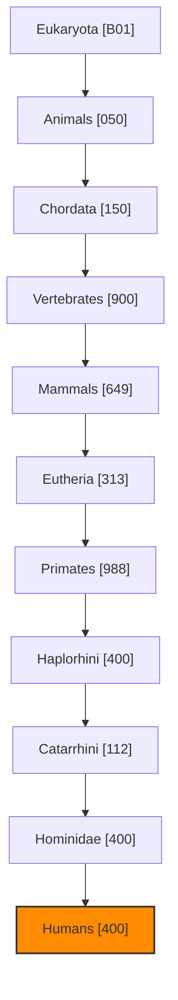
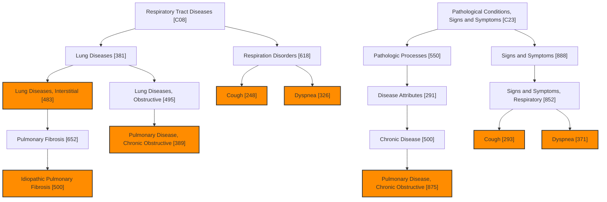
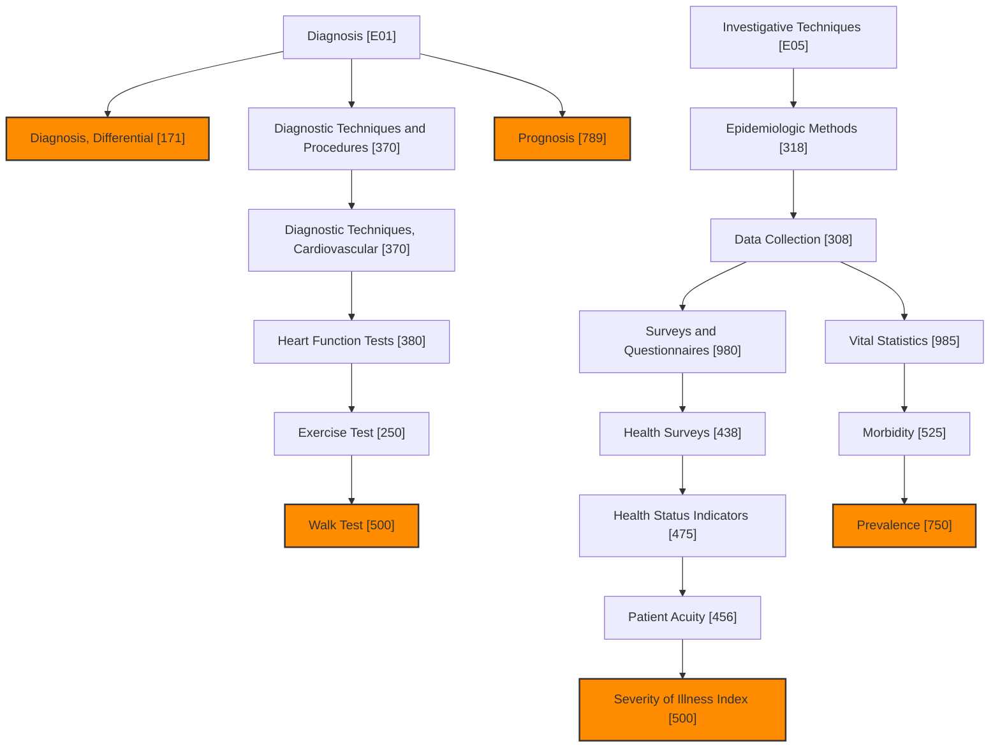
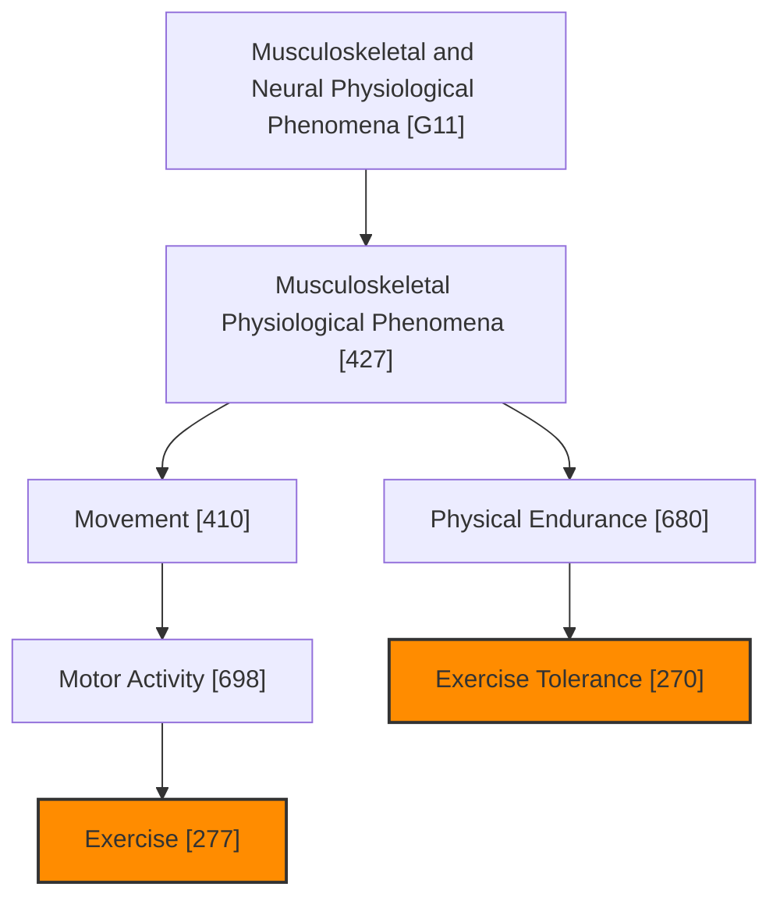
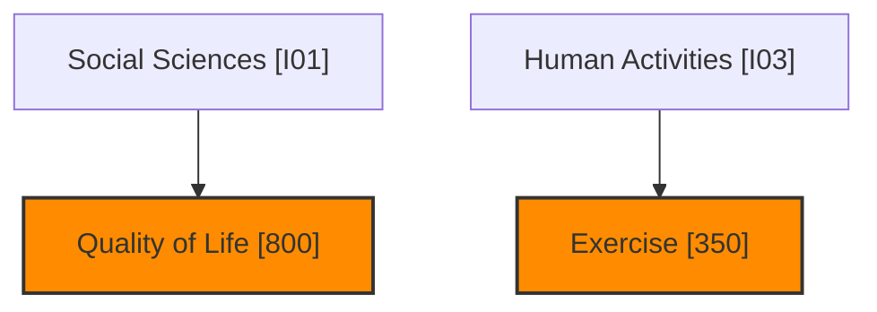
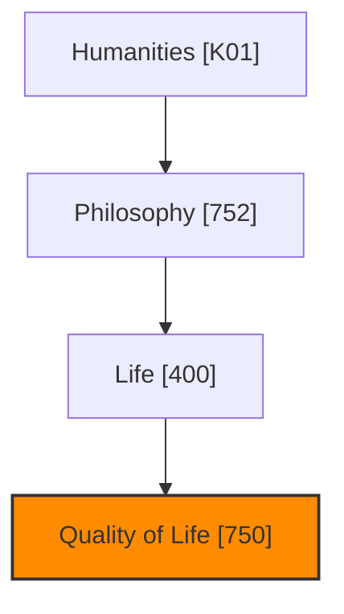
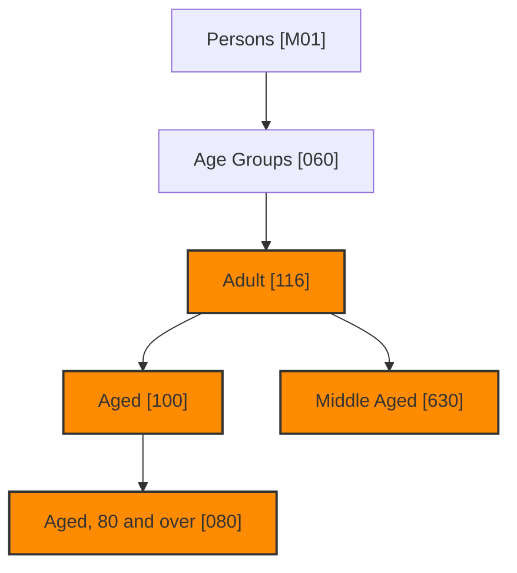
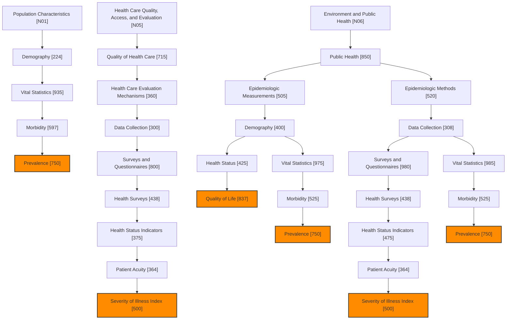

# シードスタディのMeSH用語分析
生成日時: 2025-08-13 22:10:29

## 分析サマリー

- 分析論文数: 10件
- 抽出されたユニークMeSH用語数: 59個

## 主要なMeSH用語（出現頻度順 - 上位20件）

| MeSH UI | MeSH 用語 | 出現数 | 主要トピック論文数 |
|---------|----------|-------|------------------|
| D006801 | Humans | 10 | 0 |
| D004417 | Dyspnea | 7 | 2 |
| D017563 | Lung Diseases, Interstitial | 6 | 4 |
| D000368 | Aged | 5 | 0 |
| D008875 | Middle Aged | 5 | 0 |
| D054990 | Idiopathic Pulmonary Fibrosis | 4 | 2 |
| D011788 | Quality of Life | 4 | 1 |
| D000328 | Adult | 4 | 0 |
| D005260 | Female | 4 | 0 |
| D017079 | Exercise Tolerance | 3 | 1 |
| D003937 | Diagnosis, Differential | 3 | 0 |
| D008297 | Male | 3 | 0 |
| D029424 | Pulmonary Disease, Chronic Obstructive | 2 | 2 |
| D003371 | Cough | 2 | 1 |
| D012720 | Severity of Illness Index | 2 | 1 |
| D011379 | Prognosis | 2 | 0 |
| D015444 | Exercise | 2 | 0 |
| D015995 | Prevalence | 2 | 0 |
| D000369 | Aged, 80 and over | 2 | 0 |
| D000070857 | Walk Test | 2 | 0 |

## MeSH用語の階層構造 (上位用語ベース)

以下のMermaid図は、論文から抽出された主要なMeSH用語とその階層構造をカテゴリ別に示しています。
未知の親階層の用語名も可能な限り補完しています。

## カテゴリ B: 生物 (Organisms)

| MeSH UI | MeSH 用語 | 出現数 | ツリー番号 (カテゴリ内) |
|---------|----------|-------|-----------------------|
| D006801 | Humans | 10 | B01.050.150.900.649.313.988.400.112.400.400 |
| D056890 | Eukaryota | 0 | B01 |
| D000818 | Animals | 0 | B01.050 |
| D043344 | Chordata | 0 | B01.050.150 |
| D014714 | Vertebrates | 0 | B01.050.150.900 |
| D008322 | Mammals | 0 | B01.050.150.900.649 |
| D000073566 | Eutheria | 0 | B01.050.150.900.649.313 |
| D011323 | Primates | 0 | B01.050.150.900.649.313.988 |
| D000882 | Haplorhini | 0 | B01.050.150.900.649.313.988.400 |
| D051079 | Catarrhini | 0 | B01.050.150.900.649.313.988.400.112 |
| D015186 | Hominidae | 0 | B01.050.150.900.649.313.988.400.112.400 |

## カテゴリ C: 疾患 (Diseases)

| MeSH UI | MeSH 用語 | 出現数 | ツリー番号 (カテゴリ内) |
|---------|----------|-------|-----------------------|
| D004417 | Dyspnea | 7 | C08.618.326, C23.888.852.371 |
| D017563 | Lung Diseases, Interstitial | 6 | C08.381.483 |
| D054990 | Idiopathic Pulmonary Fibrosis | 4 | C08.381.483.652.500 |
| D029424 | Pulmonary Disease, Chronic Obstructive | 2 | C08.381.495.389, C23.550.291.500.875 |
| D003371 | Cough | 2 | C08.618.248, C23.888.852.293 |
| D012140 | Respiratory Tract Diseases | 0 | C08 |
| D008171 | Lung Diseases | 0 | C08.381 |
| D011658 | Pulmonary Fibrosis | 0 | C08.381.483.652 |
| D008173 | Lung Diseases, Obstructive | 0 | C08.381.495 |
| D012120 | Respiration Disorders | 0 | C08.618 |
| D013568 | Pathological Conditions, Signs and Symptoms | 0 | C23 |
| D010335 | Pathologic Processes | 0 | C23.550 |
| D020969 | Disease Attributes | 0 | C23.550.291 |
| D002908 | Chronic Disease | 0 | C23.550.291.500 |
| D012816 | Signs and Symptoms | 0 | C23.888 |
| D012818 | Signs and Symptoms, Respiratory | 0 | C23.888.852 |

## カテゴリ E: 分析・診断・治療技術と装置 (Techniques and Equipment)

| MeSH UI | MeSH 用語 | 出現数 | ツリー番号 (カテゴリ内) |
|---------|----------|-------|-----------------------|
| D003937 | Diagnosis, Differential | 3 | E01.171 |
| D012720 | Severity of Illness Index | 2 | E05.318.308.980.438.475.456.500 |
| D011379 | Prognosis | 2 | E01.789 |
| D015995 | Prevalence | 2 | E05.318.308.985.525.750 |
| D000070857 | Walk Test | 2 | E01.370.370.380.250.500 |
| D003933 | Diagnosis | 0 | E01 |
| D019937 | Diagnostic Techniques and Procedures | 0 | E01.370 |
| D003935 | Diagnostic Techniques, Cardiovascular | 0 | E01.370.370 |
| D006334 | Heart Function Tests | 0 | E01.370.370.380 |
| D005080 | Exercise Test | 0 | E01.370.370.380.250 |
| D008919 | Investigative Techniques | 0 | E05 |
| D004812 | Epidemiologic Methods | 0 | E05.318 |
| D003625 | Data Collection | 0 | E05.318.308 |
| D011795 | Surveys and Questionnaires | 0 | E05.318.308.980 |
| D006306 | Health Surveys | 0 | E05.318.308.980.438 |
| D006305 | Health Status Indicators | 0 | E05.318.308.980.438.475 |
| D062072 | Patient Acuity | 0 | E05.318.308.980.438.475.456 |
| D014798 | Vital Statistics | 0 | E05.318.308.985 |
| D009017 | Morbidity | 0 | E05.318.308.985.525 |

## カテゴリ G: 生物学・物理学 (Biological Sciences)

| MeSH UI | MeSH 用語 | 出現数 | ツリー番号 (カテゴリ内) |
|---------|----------|-------|-----------------------|
| D017079 | Exercise Tolerance | 3 | G11.427.680.270 |
| D015444 | Exercise | 2 | G11.427.410.698.277 |
| D055687 | Musculoskeletal and Neural Physiological Phenomena | 0 | G11 |
| D009142 | Musculoskeletal Physiological Phenomena | 0 | G11.427 |
| D009068 | Movement | 0 | G11.427.410 |
| D009043 | Motor Activity | 0 | G11.427.410.698 |
| D010807 | Physical Endurance | 0 | G11.427.680 |

## カテゴリ I: 人類学・教育・社会・社会現象 (Social Phenomena)

| MeSH UI | MeSH 用語 | 出現数 | ツリー番号 (カテゴリ内) |
|---------|----------|-------|-----------------------|
| D011788 | Quality of Life | 4 | I01.800 |
| D015444 | Exercise | 2 | I03.350 |
| D012942 | Social Sciences | 0 | I01 |
| D006802 | Human Activities | 0 | I03 |

## カテゴリ K: 人文科学 (Humanities)

| MeSH UI | MeSH 用語 | 出現数 | ツリー番号 (カテゴリ内) |
|---------|----------|-------|-----------------------|
| D011788 | Quality of Life | 4 | K01.752.400.750 |
| D006809 | Humanities | 0 | K01 |
| D010684 | Philosophy | 0 | K01.752 |
| D019369 | Life | 0 | K01.752.400 |

## カテゴリ M: 人物 (Named Groups)

| MeSH UI | MeSH 用語 | 出現数 | ツリー番号 (カテゴリ内) |
|---------|----------|-------|-----------------------|
| D000368 | Aged | 5 | M01.060.116.100 |
| D008875 | Middle Aged | 5 | M01.060.116.630 |
| D000328 | Adult | 4 | M01.060.116 |
| D000369 | Aged, 80 and over | 2 | M01.060.116.100.080 |
| D009272 | Persons | 0 | M01 |
| D009273 | Age Groups | 0 | M01.060 |

## カテゴリ N: 健康管理 (Health Care)

| MeSH UI | MeSH 用語 | 出現数 | ツリー番号 (カテゴリ内) |
|---------|----------|-------|-----------------------|
| D011788 | Quality of Life | 4 | N06.850.505.400.425.837 |
| D012720 | Severity of Illness Index | 2 | N05.715.360.300.800.438.375.364.500, N06.850.520.308.980.438.475.364.500 |
| D015995 | Prevalence | 2 | N01.224.935.597.750, N06.850.505.400.975.525.750, N06.850.520.308.985.525.750 |
| D011154 | Population Characteristics | 0 | N01 |
| D003710 | Demography | 0 | N01.224 |
| D017530 | Health Care Quality, Access, and Evaluation | 0 | N05 |
| D011787 | Quality of Health Care | 0 | N05.715 |
| D017531 | Health Care Evaluation Mechanisms | 0 | N05.715.360 |
| D004778 | Environment and Public Health | 0 | N06 |
| D011634 | Public Health | 0 | N06.850 |
| D015991 | Epidemiologic Measurements | 0 | N06.850.505 |
| D006304 | Health Status | 0 | N06.850.505.400.425 |

## カテゴリ X: カテゴリ X

| MeSH UI | MeSH 用語 | 出現数 | ツリー番号 (カテゴリ内) |
|---------|----------|-------|-----------------------|
| D005260 | Female | 4 | X999999 |
| D008297 | Male | 3 | X999998 |

### 凡例

- オレンジ色のノード: Seed論文に実際に付与されていたMeSH用語 (上位20件に含まれるもの)
- 通常のノード: 上記MeSH用語の階層を構成する親ノード (可能な場合、用語名を補完)

## 論文別MeSH用語

### PMID: 38648021

- タイトル: Interstitial Lung Disease: A Review.
- ジャーナル: JAMA (2024)
- 著者: Maher Toby M
- MeSH用語数: 13

| MeSH UI | MeSH 用語 | 主要トピック | 修飾語 |
|---------|----------|------------|-------|
| D006801 | Humans | No |  |
| D000088962 | Antifibrotic Agents | No | therapeutic use |
| D003240 | Connective Tissue Diseases | No | complications, diagnosis, therapy |
| D004417 | Dyspnea | No | etiology |
| D054990 | Idiopathic Pulmonary Fibrosis | No | complications, diagnosis, therapy |
| D007211 | Indoles | No | therapeutic use |
| D017563 | Lung Diseases, Interstitial | Yes | diagnosis, etiology, therapy |
| D016040 | Lung Transplantation | No |  |
| D011379 | Prognosis | No |  |
| D011728 | Pyridones | No | therapeutic use |
| D019141 | Respiratory System Agents | No | therapeutic use |
| D014481 | United States | No |  |
| D014797 | Vital Capacity | No |  |

---

### PMID: 35964592

- タイトル: Interstitial lung diseases.
- ジャーナル: Lancet (London, England) (2022)
- 著者: Wijsenbeek Marlies, Suzuki Atsushi, Maher Toby M
- MeSH用語数: 7

| MeSH UI | MeSH 用語 | 主要トピック | 修飾語 |
|---------|----------|------------|-------|
| D004417 | Dyspnea | No | etiology |
| D017079 | Exercise Tolerance | No |  |
| D006801 | Humans | No |  |
| D008168 | Lung | No |  |
| D017563 | Lung Diseases, Interstitial | Yes | diagnosis, epidemiology, etiology |
| D011658 | Pulmonary Fibrosis | Yes | complications, etiology |
| D011788 | Quality of Life | No |  |

---

### PMID: 34559419

- タイトル: Pulmonary rehabilitation for interstitial lung disease.
- ジャーナル: The Cochrane database of systematic reviews (2021)
- 著者: Dowman Leona, Hill Catherine J, May Anthony, Holland Anne E
- MeSH用語数: 9

| MeSH UI | MeSH 用語 | 主要トピック | 修飾語 |
|---------|----------|------------|-------|
| D000328 | Adult | No |  |
| D000368 | Aged | No |  |
| D004417 | Dyspnea | No | etiology, rehabilitation |
| D015444 | Exercise | No |  |
| D017079 | Exercise Tolerance | No |  |
| D006801 | Humans | No |  |
| D017563 | Lung Diseases, Interstitial | Yes |  |
| D008875 | Middle Aged | No |  |
| D011788 | Quality of Life | Yes |  |

---

### PMID: 36701677

- タイトル: Differential Diagnosis of Suspected Chronic Obstructive Pulmonary Disease Exacerbations in the Acute Care Setting: Best Practice.
- ジャーナル: American journal of respiratory and critical care medicine (2023)
- 著者: Celli Bartolome R, Fabbri Leonardo M, Aaron Shawn D, Agusti Alvar, Brook Robert D, Criner Gerard J, Franssen Frits M E, Humbert Marc, Hurst John R, Montes de Oca Maria, Pantoni Leonardo, Papi Alberto, Rodriguez-Roisin Roberto, Sethi Sanjay, Stolz Daiana, Torres Antoni, Vogelmeier Claus F, Wedzicha Jadwiga A
- MeSH用語数: 5

| MeSH UI | MeSH 用語 | 主要トピック | 修飾語 |
|---------|----------|------------|-------|
| D029424 | Pulmonary Disease, Chronic Obstructive | Yes | diagnosis |
| D006801 | Humans | No |  |
| D003937 | Diagnosis, Differential | No |  |
| D004417 | Dyspnea | Yes | etiology |
| D003371 | Cough | No |  |

---

### PMID: 38536110

- タイトル: Epidemiology and Prognostic Significance of Cough in Fibrotic Interstitial Lung Disease.
- ジャーナル: American journal of respiratory and critical care medicine (2024)
- 著者: Khor Yet H, Johannson Kerri A, Marcoux Veronica, Fisher Jolene H, Assayag Deborah, Manganas Helene, Khalil Nasreen, Kolb Martin, Ryerson Christopher J
- MeSH用語数: 16

| MeSH UI | MeSH 用語 | 主要トピック | 修飾語 |
|---------|----------|------------|-------|
| D006801 | Humans | No |  |
| D003371 | Cough | Yes | etiology, physiopathology, epidemiology |
| D008297 | Male | No |  |
| D005260 | Female | No |  |
| D000368 | Aged | No |  |
| D008875 | Middle Aged | No |  |
| D011379 | Prognosis | No |  |
| D017563 | Lung Diseases, Interstitial | Yes | physiopathology, epidemiology, mortality |
| D012720 | Severity of Illness Index | Yes |  |
| D002170 | Canada | No | epidemiology |
| D054990 | Idiopathic Pulmonary Fibrosis | Yes | epidemiology, physiopathology, complications, mortality |
| D011446 | Prospective Studies | No |  |
| D011788 | Quality of Life | No |  |
| D018450 | Disease Progression | No |  |
| D012042 | Registries | No |  |
| D015995 | Prevalence | No |  |

---

### PMID: 28213592

- タイトル: The evidence of benefits of exercise training in interstitial lung disease: a randomised controlled trial.
- ジャーナル: Thorax (2017)
- 著者: Dowman Leona M, McDonald Christine F, Hill Catherine J, Lee Annemarie L, Barker Kathryn, Boote Claire, Glaspole Ian, Goh Nicole S L, Southcott Anne M, Burge Angela T, Gillies Rebecca, Martin Alicia, Holland Anne E
- MeSH用語数: 18

| MeSH UI | MeSH 用語 | 主要トピック | 修飾語 |
|---------|----------|------------|-------|
| D000368 | Aged | No |  |
| D000369 | Aged, 80 and over | No |  |
| D001195 | Asbestosis | No | physiopathology, rehabilitation |
| D004417 | Dyspnea | No | etiology |
| D015444 | Exercise | No | physiology* |
| D005081 | Exercise Therapy | Yes |  |
| D005260 | Female | No |  |
| D006801 | Humans | No |  |
| D054990 | Idiopathic Pulmonary Fibrosis | No | physiopathology, rehabilitation |
| D017563 | Lung Diseases, Interstitial | No | etiology, physiopathology*, rehabilitation* |
| D008297 | Male | No |  |
| D008875 | Middle Aged | No |  |
| D064797 | Physical Conditioning, Human | No | physiology* |
| D011788 | Quality of Life | No |  |
| D016037 | Single-Blind Method | No |  |
| D011795 | Surveys and Questionnaires | No |  |
| D013997 | Time Factors | No |  |
| D000070857 | Walk Test | No |  |

---

### PMID: 36179385

- タイトル: Qualitative validation of the modified Medical Research Council (mMRC) dyspnoea scale as a patient-reported measure of breathlessness severity.
- ジャーナル: Respiratory medicine (2022)
- 著者: Sunjaya Anthony, Poulos Leanne, Reddel Helen, Jenkins Christine
- MeSH用語数: 11

| MeSH UI | MeSH 用語 | 主要トピック | 修飾語 |
|---------|----------|------------|-------|
| D006801 | Humans | No |  |
| D055815 | Young Adult | No |  |
| D000328 | Adult | No |  |
| D008875 | Middle Aged | No |  |
| D000368 | Aged | No |  |
| D000369 | Aged, 80 and over | No |  |
| D029424 | Pulmonary Disease, Chronic Obstructive | Yes | drug therapy |
| D012720 | Severity of Illness Index | No |  |
| D004417 | Dyspnea | No | diagnosis, psychology |
| D035843 | Biomedical Research | Yes |  |
| D000071066 | Patient Reported Outcome Measures | No |  |

---

### PMID: 39129185

- タイトル: Effects of home-based telerehabilitation-assisted inspiratory muscle training in patients with idiopathic pulmonary fibrosis: A randomized controlled trial.
- ジャーナル: Respirology (Carlton, Vic.) (2024)
- 著者: Aktan Rıdvan, Tertemiz Kemal Can, Yiğit Salih, Özalevli Sevgi, Ozgen Alpaydin Aylin, Uçan Eyüp Sabri
- MeSH用語数: 16

| MeSH UI | MeSH 用語 | 主要トピック | 修飾語 |
|---------|----------|------------|-------|
| D006801 | Humans | No |  |
| D008297 | Male | No |  |
| D005260 | Female | No |  |
| D054990 | Idiopathic Pulmonary Fibrosis | Yes | rehabilitation, physiopathology |
| D000368 | Aged | No |  |
| D001945 | Breathing Exercises | Yes | methods |
| D000069350 | Telerehabilitation | Yes |  |
| D012132 | Respiratory Muscles | Yes | physiopathology |
| D004417 | Dyspnea | Yes | rehabilitation, etiology, physiopathology |
| D017079 | Exercise Tolerance | Yes | physiology |
| D008875 | Middle Aged | No |  |
| D053580 | Muscle Strength | No | physiology |
| D016896 | Treatment Outcome | No |  |
| D012129 | Respiratory Function Tests | No |  |
| D006699 | Home Care Services | No |  |
| D000070857 | Walk Test | No |  |

---

### PMID: 28487307

- タイトル: Aripiprazole-induced hypersensitivity pneumonitis.
- ジャーナル: BMJ case reports (2017)
- 著者: Gunasekaran Kulothungan, Murthi Swetha, Jennings Jeffrey, Lone Nazir
- MeSH用語数: 10

| MeSH UI | MeSH 用語 | 主要トピック | 修飾語 |
|---------|----------|------------|-------|
| D000328 | Adult | No |  |
| D000542 | Alveolitis, Extrinsic Allergic | No | chemically induced, diagnosis*, diagnostic imaging |
| D014150 | Antipsychotic Agents | No | adverse effects* |
| D000068180 | Aripiprazole | No | adverse effects* |
| D003937 | Diagnosis, Differential | No |  |
| D005260 | Female | No |  |
| D006801 | Humans | No |  |
| D017563 | Lung Diseases, Interstitial | No | chemically induced, diagnosis*, diagnostic imaging |
| D012559 | Schizophrenia | No | drug therapy |
| D014057 | Tomography, X-Ray Computed | No |  |

---

### PMID: 16817954

- タイトル: Hypersensitivity pneumonitis.
- ジャーナル: Orphanet journal of rare diseases (2006)
- 著者: Lacasse Yves, Cormier Yvon
- MeSH用語数: 9

| MeSH UI | MeSH 用語 | 主要トピック | 修飾語 |
|---------|----------|------------|-------|
| D000328 | Adult | No |  |
| D000542 | Alveolitis, Extrinsic Allergic | No | classification, diagnosis*, epidemiology, therapy* |
| D003937 | Diagnosis, Differential | No |  |
| D005203 | Farmer's Lung | No | epidemiology |
| D014943 | Global Health | No |  |
| D006801 | Humans | No |  |
| D015994 | Incidence | No |  |
| D008171 | Lung Diseases | No | diagnosis |
| D015995 | Prevalence | No |  |

---

